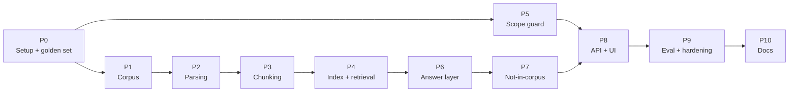

# Implementation Plan: Dietary Guidance RAG Chatbot

This plan breaks the build into phases. It follows the design in [ARCHITECTURE.md](ARCHITECTURE.md) and the requirements in [problem-statement.md](problem-statement.md). Section references like "§5.2" point to ARCHITECTURE.md. The product is named **TruNutri RAG chatbot**; the Python package is `guidance_rag`.

Each phase lists its **goal**, **sub-tasks**, **deliverables** and **exit criteria**. A phase is done only when its exit criteria pass. Most exit criteria are automated tests.

### How sub-tasks are written

Each sub-task has a number such as **2.3** (phase 2, sub-task 3). It is sized to be finished and checked on its own, as one pull request.

- **Steps:** a checklist to work through.
- **Files:** what the sub-task creates or changes.
- **Depends on:** listed only when a sub-task needs something other than the one just before it.
- **Done when:** a check that says the sub-task is finished.

---

## Overview

| Phase | Name | Brief requirement covered | Sub-tasks | Status |
|-------|------|---------------------------|-----------|--------|
| 0 | Project setup and golden test set | — (foundation) | 0.1 – 0.5 | ✅ Done |
| 1 | Corpus acquisition and registry | #1 Corpus | 1.1 – 1.5 | ✅ Done |
| 2 | Parsing to a document tree | #2 Chunking (input) | 2.1 – 2.9 | ✅ Done |
| 3 | Structure-aware chunking | #2 Chunking | 3.1 – 3.9 | ✅ Done |
| 4 | Indexing and retrieval | #3 Retrieval | 4.1 – 4.9 | ✅ Done |
| 5 | Scope guard (out-of-scope refusal) | #6b Out-of-scope refusal | 5.1 – 5.7 | ✅ Done |
| 6 | Grounded answer layer | #4 Answer layer, #5 Cross-document | 6.1 – 6.8 | ✅ Done |
| 7 | Not-in-corpus refusal | #6a Not-in-corpus refusal | 7.1 – 7.5 | ✅ Done |
| 8 | API and minimal chat UI | — (usable prototype) | 8.1 – 8.6 | ✅ Done |
| 9 | Evaluation, tuning and hardening | All | 9.1 – 9.8 | 🟡 Targets met except p95 latency (8.4 s vs 8 s); full eval to re-run after 9.7; eval CI not yet run on GitHub |
| 10 | Documentation | README chunking write-up | 10.1 – 10.4 | Not started |

Status as of 2026-10-08. Each phase's sub-tasks carry their own **Status** notes, and each finished phase has a **Result** line under its exit criteria.

### Phase dependencies



**Phase 5 (scope guard) is independent of the RAG pipeline.** It needs no index or LLM, so it can be built in parallel with Phases 1–4.

---

## Phase 0: Project setup and golden test set

**Goal:** a working Python project, plus the test questions that define "done" before any pipeline code exists.

### 0.1 Repository skeleton and tooling
- [x] Create the folders from §12: `src/guidance_rag/{ingest,query}/`, `corpus/{raw,overrides,chunks}/`, `eval/`, `tests/`.
- [x] Set up Python 3.12 with `uv` (or Poetry). Create `pyproject.toml` with pinned dependencies.
- [x] Add `ruff` and `mypy` config to `pyproject.toml`. Add `pytest` with a `tests/conftest.py`.
- [x] Add a `.pre-commit-config.yaml` that runs ruff and mypy.

**Files:** `pyproject.toml`, `.pre-commit-config.yaml`, package `__init__.py` files
**Done when:** `uv run pytest` and `uv run ruff check .` both succeed locally.

### 0.2 CI workflow
- [ ] Add a GitHub Actions workflow that installs dependencies and runs ruff, mypy and pytest on each push and pull request.

**Files:** `.github/workflows/ci.yml`
**Done when:** a pushed commit shows a green CI run.
**Status:** workflow written and its steps pass locally; not yet run on GitHub (the repo has no remote).

### 0.3 Configuration
- [x] Write `config.py` with a `pydantic-settings` `Settings` class: `GROQ_API_KEY`, index path or URL, embedding model, reranker model, generator model (`openai/gpt-oss-120b`), evidence-check model (`openai/gpt-oss-20b`), and placeholder thresholds (`tau_doc`, `tau_answer`). *(LLM provider switched from Anthropic to Groq on 2026-10-06.)*
- [x] Add `.env.example` with every setting.
- [x] Add `.env`, `corpus/raw/` and local index data to `.gitignore`.

**Files:** `src/guidance_rag/config.py`, `.env.example`, `.gitignore`
**Done when:** `Settings()` loads from `.env`, and a test shows that a missing API key raises a clear error.

### 0.4 Core data models
- [x] In `models.py`, define the Pydantic models `SourceDocument` (§3.2) and `Chunk` (§5.3).
- [x] Define the answer models: `Claim(text, chunk_ids)`, `DocAnswer(doc_id, claims)`, `Citation`, `Refusal(category, message)` and `Answer(status, sections, citations, docs_searched, refusal, trace_id)`.
- [x] Add the enums: `AnswerStatus` (`answered | partial | not_in_corpus | out_of_scope`) and `BlockType`.

**Files:** `src/guidance_rag/models.py`, `tests/test_models.py`
**Done when:** round-trip tests (model → JSON → model) pass for each model.

### 0.5 Golden test set (first version)
- [x] Define the schema for one golden entry: `id`, `question`, `category`, `doc_filter?`, `expected_status`, `expected_doc_ids`, `expected_answer_notes`, `gold_chunk_ids` (left empty until Phase 3).
- [x] Write about 40 questions covering every category in §11.1:
  - ~10 single-document factual (including ~4 table lookups and ~3 numbered recommendations)
  - ~5 filtered to a named document
  - ~5 cross-document (cooking oil, food storage, food handling)
  - ~6 not in the corpus (including 2 that name a document outside the corpus)
  - ~10 out of scope (medical, calorie target, body weight, nutrient lookup, prompt injection)
  - ~4 "near misses" that **must be answered** (e.g. "What does WHO say about salt and blood pressure?")
- [x] For each in-corpus question, look up the answer in the source document and note the expected `doc_id`s and answer text.
- [x] Write a loader with a test that validates the file against the schema.

**Files:** `eval/golden.yaml`, `eval/golden.py`, `tests/test_golden_schema.py`
**Done when:** the file loads and validates, with at least 3 questions in every category.
**Status:** 45 questions; all checked against the downloaded sources in 1.5 (`verified: true`, golden set v2).

### Deliverables
- Project skeleton, CI pipeline, `config.py`, `models.py`, `eval/golden.yaml` (first version).

### Exit criteria
- `pytest`, `ruff` and `mypy` pass in CI.
- `golden.yaml` validates against its schema, with at least 3 questions in every category.

---

## Phase 1: Corpus acquisition and registry

**Goal:** the 7 source documents are downloaded with full provenance (brief #1).

### 1.1 Registry file and loader
- [x] Write `corpus/registry.yaml` with every source in §3.1, using the fields in §3.2. Mark each `included`, `reserve` or `excluded`, and add `exclusion_reason` where needed.
- [x] Add an `aliases` list to each entry (used by the query analyzer in 4.7).
- [x] Write `registry.py` with `load_registry()` and `save_registry()` built on `SourceDocument`.

**Files:** `corpus/registry.yaml`, `src/guidance_rag/registry.py`
**Done when:** the registry loads, and a test checks that `doc_id`s are unique.

### 1.2 Choose the JECFA report
- [x] Browse the JECFA reports page and pick one recent Technical Report with a downloadable PDF and readable prose.
- [x] Add its direct PDF URL, title and year to the registry.

**Files:** `corpus/registry.yaml`
**Done when:** the JECFA entry has a direct PDF URL that opens in a browser.

### 1.3 Fetcher
- [x] Write `fetch.py` using `httpx` with retries, a timeout and a browser-like user-agent.
- [x] Save each `included` document to `corpus/raw/{doc_id}.{pdf|html}`.
- [x] Compute SHA-256. If it matches the registry, skip the document. If not, write the new `sha256` and today's `retrieval_date` back to the registry.
- [x] Resolve the direct DGI 2024 PDF URL (the brief's link goes through a pdf.js viewer).
- [x] If a site blocks the script, save the file by hand and set `retrieval_method: manual` in the registry.

**Files:** `src/guidance_rag/ingest/fetch.py`, `tests/test_fetch.py` (with a mocked HTTP client)
**Done when:** a second run downloads nothing, and the tests cover the "changed" and "unchanged" cases.

### 1.4 CLI entry point
- [x] Add a Typer (or argparse) CLI: `python -m guidance_rag.ingest fetch [--doc DOC_ID]`.

**Files:** `src/guidance_rag/ingest/__main__.py`
**Done when:** the command fetches one document or all of them.
**Status:** also adds `check` (page count, text layer, title text) and `fetch --refresh` / `--include-reserve`.

### 1.5 Manual check of each download
- [x] Open every raw file. Check the page count, that text can be selected (it has a text layer), and that it isn't a cookie wall or redirect page.
- [x] Confirm the **publication** year of each document and correct the registry where needed (FSSAI filenames show 2018–2020).
- [x] Note any scanned pages that will need OCR in Phase 2.
- [x] Check each `expected_answer_notes` in `eval/golden.yaml` against its source document, correct it, and set `verified: true`. Replace `KNOWN_DOC_IDS` in `eval/golden.py` with the registry's `doc_id`s, and set the real JECFA `doc_id`.
- [x] Add a test that every `included` entry has `publisher`, `year`, `source_url`, `retrieval_date` and `sha256`.

**Files:** `corpus/registry.yaml`, `tests/test_registry.py`
**Done when:** the completeness test passes, and each raw file contains its expected title text.
**Status:** done. FoodSafety.gov blocks scripts (HTTP 403), so it is fetched from the Internet Archive copy of 2026-10-01 (`retrieval_method: archive`). JECFA report chosen: TRS 1058 (100th report, 2025). Pages with no text layer: FSSAI Milk p. 74–75 (scanned checklist, **needs OCR in 2.8**); FSSAI Fruits & Vegetables p. 68, 72 (HACCP diagrams); the rest are blank. Golden set v2: 7 questions corrected or replaced after checking the sources (tl-04, rc-01, sd-05, cd-03, nc-02, nc-03, plus wording fixes).

### Deliverables
- `registry.yaml` with complete provenance; `fetch.py`; CLI; raw files stored locally.

### Exit criteria
- Running the fetch command twice downloads nothing the second time.
- Every `included` entry has `publisher`, `year`, `source_url`, `retrieval_date` and `sha256`.
- Each raw file opens and contains its document's expected title text.

### Risks
| Risk | Mitigation |
|------|-----------|
| The DGI PDF is served through a pdf.js viewer URL, and the direct link may change | Resolve the direct PDF URL and record it. Keep a checksum so a change is noticed |
| FoodSafety.gov blocks scripted requests | Save the HTML by hand once and record it as `retrieval_method: manual` |
| A document has no text layer (scanned) | Find out now. Plan OCR in Phase 2, or swap in a reserve document |

---

## Phase 2: Parsing to a document tree

**Goal:** each raw file becomes a typed tree of sections and blocks (paragraph, list, table, recommendation), with page numbers. This is the hardest phase.

### 2.1 Document tree types
- [x] In `tree.py`, define `Block(type, text, page, anchor?, table: Table | None)`, `Table(caption, header_rows, rows)` and `Section(heading, level, page, anchor?, blocks, children)`.
- [x] Add helpers: `walk()` (yields every block with its section path) and `outline()` (returns the heading tree as text).

**Files:** `src/guidance_rag/ingest/tree.py`, `tests/test_tree.py`
**Done when:** tests build a small tree by hand, and `walk()` returns blocks with the correct section paths.
**Status:** done. The tree keeps only what later stages need (text, structure, pages, anchors). `Block` also has `page_end`, `items` (for lists) and `ocr`. The anchor lives on `Section` only, since HTML blocks have no ids of their own. A shared `TreeBuilder` nests headings by level, merges a title repeated on a divider page, drops reference/contents/glossary/abbreviation sections and prunes empty sections.

### 2.2 Per-document parser config
- [x] Add an optional `parser` block to each registry entry: `heading_font_sizes`, `heading_regex`, `recommendation_regex` (e.g. `^Guideline \d+`), `skip_pages` (cover, contents, index, references) and `table_strategy`.
- [x] Add the matching `ParserConfig` model.

**Files:** `corpus/registry.yaml`, `src/guidance_rag/models.py`
**Done when:** the registry loads with parser config for every PDF document.
**Status:** done, for all 7 documents. `heading_font_sizes` and `heading_regex` became a list of `HeadingRule`s (size range, bold, pattern, level, `nest_by_number`), because the FSSAI documents need size *and* numbering to set levels. Added: `heading_source: toc` (JECFA's bookmarks), `headings_only_pages` (flowcharts), `max_body_font_size` (infographic labels), `drop_pull_quotes`, `drop_sections`, HTML `content_selector`/`drop_selectors`, and `notes` explaining each document's settings.

### 2.3 HTML parser
- [x] Use BeautifulSoup to find the main content element. Remove navigation, footers, "related links" and cookie banners.
- [x] Map `h1–h6` to nested sections, `p` to paragraphs, `ul/ol` to list blocks and `table` to table blocks, with `thead`/`th` rows kept as header rows.
- [x] Keep each heading's `id` attribute as its `anchor` for deep links.
- [x] Save fixture snippets of the WHO and FoodSafety.gov pages in `tests/fixtures/`.

**Files:** `src/guidance_rag/ingest/parse_html.py`, `tests/test_parse_html.py`, `tests/fixtures/*.html`
**Done when:** the fixture tests produce the expected outline, and FoodSafety.gov tables keep their header rows.
**Status:** done. Rowspans and colspans are expanded, so every chart row carries its food category ("Hot dogs | Unopened package | 2 weeks | 1 to 2 months"). Neither page has heading ids, so headings without one get a text-fragment anchor (`#:~:text=Sugars`). Nested lists fold into their parent item.

### 2.4 PDF text extraction
- [x] Use PyMuPDF to extract text spans per page with font size, bold flag, position and page number.
- [x] Merge spans into lines and lines into paragraphs, using vertical gaps.
- [x] Skip the pages listed in `skip_pages`.

**Files:** `src/guidance_rag/ingest/parse_pdf.py`, `tests/test_parse_pdf.py`, `tests/fixtures/*.pdf` (3-page excerpts)
**Done when:** a fixture page comes back as paragraphs in reading order with correct page numbers.
**Status:** done. The PDF fixtures are generated inside the tests with PyMuPDF instead of being committed as excerpts; each synthetic page reproduces one layout from the corpus. Also handled: two-column reading order (DGI), list markers that are separate text runs ("i." + text) and hanging continuation lines (FSSAI), paragraph breaks measured from each page's own line spacing, pull quotes, letter-spaced words, a space glyph extracted as U+0001 (DGI), and superscript-zero degree signs ("4" + raised "0" + "C" is "4°C", not "40C").

### 2.5 Remove running headers and footers
- [x] Find lines that repeat at roughly the same position on most pages, plus page numbers, and remove them.

**Files:** `src/guidance_rag/ingest/parse_pdf.py`
**Done when:** a test confirms that the fixture's running header and page number are gone.
**Status:** done. Also removed: vertical side text (JECFA), page numbers printed above the margin on landscape pages (matched by the printed-vs-PDF page offset), and stray superscripts.

### 2.6 PDF heading and recommendation detection
- [x] Mark a line as a heading if its font size is in `heading_font_sizes` or it matches `heading_regex`. Set its level from the font size.
- [x] Mark the start of a numbered recommendation using `recommendation_regex`. The recommendation runs until the next heading or recommendation.
- [x] Build the `Section` tree from the headings.

**Files:** `src/guidance_rag/ingest/parse_pdf.py`
**Done when:** the DGI fixture produces one recommendation block per guideline.
**Status:** done. Each DGI guideline is a top-level section ("GUIDELINE 11 Restrict salt intake"). Its "RATIONALE" and "POINTS TO REGISTER" boxes are the recommendation blocks: 17 of each. JECFA's headings come from its 242 bookmarks. Wrapped heading lines are joined, and a bold lead-in that continues as a sentence is kept as text.

### 2.7 PDF table extraction
- [x] Use `pdfplumber` to find tables on each page, with `camelot` as a fallback according to `table_strategy`.
- [x] Remove the table area's text from the paragraph stream so it isn't indexed twice.
- [x] Join tables that continue across pages when the header row repeats or the columns line up.
- [x] Load hand-corrected tables from `corpus/overrides/{doc_id}/{table_id}.csv` and use them in place of the parser output.

**Files:** `src/guidance_rag/ingest/parse_pdf.py`, `src/guidance_rag/ingest/overrides.py`
**Done when:** a fixture table comes back with its header and rows, and no table text appears in nearby paragraphs.
**Status:** done, using PyMuPDF's `find_tables` (a port of pdfplumber's algorithm) instead of pdfplumber/camelot: one PDF library, the same coordinates as the text, and no Ghostscript dependency. Merged cells are filled across or down depending on the spanning cell; leading bold rows (up to 3) are the header; a "Table N" caption above the table is attached. Two FSSAI Milk tables are hand-corrected (`p20-t1` lighting, `p29-t1` transport temperatures). JECFA's tables have no ruling lines and text-based detection splits words, so they stay as text (`table_strategy: none`).

### 2.8 OCR fallback (needed: 1.5 found scanned pages in FSSAI Milk, p. 74–75)
- [x] Find pages with no text layer and run `ocrmypdf` on them.
- [x] Set `ocr=True` on blocks from those pages.

**Files:** `src/guidance_rag/ingest/parse_pdf.py`
**Done when:** text from the scanned pages appears in the tree with the `ocr` flag set.
**Status:** done with RapidOCR (English PP-OCRv5 model) instead of `ocrmypdf`, which needs Tesseract and Ghostscript installed on the system. RapidOCR is pip-only, behind the optional `ocr` extra (`uv sync --extra ocr`). The Milk checklist text comes back readable ("…immediately chilled to a temperature of 4°C or lower").

### 2.9 Outline dump and full-corpus review
- [x] Add a CLI command: `python -m guidance_rag.ingest parse --dump`. It prints the outline, block counts and table count for each document.
- [ ] Optional: run `docling` on DGI 2024 and compare its outline and tables. Switch to it for PDFs if it is clearly better.
- [x] Review each dump against the source document. Fix the parser config, or add table overrides, until the outline is right.

**Files:** `src/guidance_rag/ingest/__main__.py`, `corpus/overrides/`
**Done when:** the Phase 2 exit criteria below pass.
**Status:** done; the docling comparison was not run. `parse --full` also prints every block's text for review. `parse --save` writes each tree to `corpus/parsed/{doc_id}.json` with a fingerprint of the raw file, parser config, overrides and parser code; `load_or_parse()` (for Phase 3) reuses a saved tree only while the fingerprint matches. The exit criteria are automated in `tests/test_corpus_parse.py` (marker `corpus`, skipped when `corpus/raw/` is empty). Pages left out on purpose: front matter, blank record templates and DGI's personalised meal plans (calorie and body-weight targets are out of scope). Known residue: two figure labels in DGI become sub-headings, and OCR'd checklist rows sometimes take the neighbouring item number.

### Deliverables
- `parse_html.py`, `parse_pdf.py`, `tree.py`, per-document parser config, table overrides, an outline dump for each document, and the parsed trees in `corpus/parsed/*.json`.

### Exit criteria
- The DGI 2024 outline lists every numbered guideline as its own section or recommendation block. Check the count against the PDF's table of contents.
- The FoodSafety.gov charts parse into tables whose header row is preserved.
- Unit tests on the fixture files pass.
- Manual review: no table text appears in paragraph blocks, and no running headers remain.

---

## Phase 3: Structure-aware chunking

**Goal:** turn each parsed tree in `corpus/parsed/` into chunks that keep tables and numbered recommendations whole and carry full metadata (brief #2, §5.2).

### Chunking strategy
**Type: structure-aware (element-based) chunking, with token-limited packing and contextual chunk headers.**

- **Boundaries come from the document's structure, not a token count.** The chunker walks the parsed tree and cuts only at section, block, list-item or table-row boundaries. A chunk never crosses into another section.
- **Atomic units:** each recommendation is one chunk. A table is one chunk when it is small; a large one splits only between rows, with its header repeated.
- **Token-limited packing inside a section:** paragraphs and short lists are grouped, in order, up to a size limit, with a 1-paragraph overlap when a section needs several chunks.
- **Contextual chunk headers:** the text used for search starts with the document and section path (`[Publisher · Title · Year] [Section: A > B]`). The LLM sees the body only.

Not used, and why:
- **Fixed-size or recursive character splitting** cuts tables and numbered recommendations in half, which is the failure the brief warns about.
- **Semantic (embedding-similarity) chunking** ignores the headings and tables that the documents already mark explicitly.

| Content | Rule | Limit |
|---------|------|-------|
| Paragraphs and short lists | Packed per section, cut between blocks, 1-paragraph overlap | 400 tokens |
| Small sibling sections | Merged under their parent, headings kept as lines | each < 120 tokens |
| Recommendations | One whole chunk | (max 774; guard at 1,000) |
| Tables | Whole if small; otherwise row groups that never split a first-column category, caption and header repeated | whole ≤ 800, groups ≤ 600 |
| Long lists | Split between items, lead-in repeated | 400 tokens |

### What the parsed corpus looks like
Measured on `corpus/parsed/*.json` (7 documents, cl100k tokens). The limits below come from these numbers, not from the first draft of this plan.

| Block type | Count | Median | 90th pct | Max | What it means for chunking |
|------------|------:|-------:|---------:|----:|----------------------------|
| Paragraph | 1,559 | 34 | 131 | 365 | Paragraphs are short (716 under 30 tokens, e.g. FSSAI definitions) and none needs splitting. Pack them; never cut inside one. |
| List | 381 | 116 | 348 | 1,548 | 13 lists exceed 400 tokens (long FSSAI "i.–xx." lists). Only 33 lists follow a paragraph ending in ":"; for the rest, the heading is the lead-in. |
| Recommendation | 34 | 139 | 286 | 774 | All fit in one chunk. They are never split. |
| Table | 103 | 394 | 1,462 | 25,918 | 24 exceed 1,000 tokens. Several FSSAI tables have no header row; HACCP tables have 11–20 columns. Two are broken: DGI `p47-t1` (one 1,600-character cell copied across a weekly menu) and `p33-t1` (an infographic detected as a table). |

- **Total size:** about 245k tokens. Simulated with the rules below: **~840 chunks** (median 232 tokens, 90th pct 398, max 788). The earlier estimate of 2–4k chunks assumed much longer documents.
- **Small sections:** 45 sections hold under 60 tokens, e.g. Poultry process steps ("Stunning", "Evisceration") and DGI age groups ("Elders", "Adults"). As separate chunks they would be too small to retrieve well.
- **FoodSafety.gov chart:** one 53-row, 1,462-token table with 13 food categories in its first column. Category is the natural split.
- **Golden set:** 45 questions, including 4 table lookups and 4 recommendations whose answers must each sit in one chunk.

### 3.1 Token counter and chunker skeleton
- [x] Add `count_tokens()` using one fixed tokenizer (`tiktoken` `cl100k_base`) as a stable approximation. (bge-m3 counts differently, but its 8k limit is far above any chunk.)
- [x] Write a `Chunker` that reads trees with `load_or_parse()` (2.9), so it uses `corpus/parsed/` and re-parses only stale documents.
- [x] Walk the tree section by section and send each block to a handler for its type.
- [x] Put the limits in config: `prose_max` 400, `table_whole_max` 800, `table_group_max` 600, `small_section_max` 120.

**Files:** `src/guidance_rag/ingest/chunker.py`, `src/guidance_rag/config.py`, `tests/test_chunker.py`
**Done when:** the skeleton runs on a hand-built tree and emits one chunk per block.
**Status:** done. The limits live in `ChunkingConfig` (`config.py`), separate from `Settings` so chunking needs no API key.

### 3.2 Section text: paragraphs and lists packed together
- [x] Pack a section's paragraphs and short lists, in order, into a buffer of up to 400 tokens. Lists stay with the text around them, because most FSSAI sections are a single list under a heading.
- [x] Cut only between blocks. When a section needs more than one chunk, start the next one with the previous paragraph (1-paragraph overlap; paragraphs are short, so this is cheap).
- [x] Never cross into another section. Tables and recommendations end the buffer and become chunks of their own.
- [x] Set `block_type` to `list` when the chunk is only a list, otherwise `prose`.

**Files:** `src/guidance_rag/ingest/chunker.py`
**Done when:** tests show no chunk over 400 tokens (unless one block is larger), no chunk spanning two sections, and the expected overlap.
**Status:** done. The overlap paragraph is repeated only if it is ≤ 133 tokens, so it never crowds out the next block.

### 3.3 Merge small sibling sections
- [x] Merge consecutive sibling sections that have no subsections, no tables or recommendations, and under 120 tokens each, into one chunk under their parent (up to 400 tokens).
- [x] Keep each merged heading as a line in the chunk text ("Stunning: …", "Evisceration: …"). Set `section_path` to the parent's path and record the merged headings in a `subsections` field.
- [x] Use the first merged section's page (or anchor) for the deep link.

**Files:** `src/guidance_rag/ingest/chunker.py`, `src/guidance_rag/models.py`
**Done when:** a test merges three small sibling sections into one chunk that lists all three headings, and leaves a large sibling on its own.
**Status:** done. Merged headings are kept as lines in the text and listed in `Chunk.subsections`.

### 3.4 Recommendations
- [x] Emit each recommendation block (DGI's RATIONALE and POINTS TO REGISTER boxes) as one chunk, with its guideline title in `section_path`.
- [x] Keep the 1,000-token guard from §5.4 as a safety net only: split at bullet points and repeat the title. No current recommendation reaches it (max 774).

**Files:** `src/guidance_rag/ingest/chunker.py`
**Done when:** tests show every recommendation is one chunk, and a synthetic 1,200-token one splits at bullets with the title repeated.
**Status:** done: 34 recommendation chunks (17 RATIONALE, 17 POINTS TO REGISTER), none split. A POINTS TO REGISTER box sits at the end of its guideline, so its `section_path` is the guideline plus its last subsection.

### 3.5 Table serialisation and sanity check
- [x] Serialise tables with up to 6 columns as Markdown, with the caption on top.
- [x] Serialise wider tables (HACCP plans, 11–20 columns) as one line per row, pairing each value with its column name ("Process step: Scalding; Hazard: B; Control: …"). In wide Markdown, values lose track of their column.
- [x] Print a value repeated across merged columns only once per row. Keep values repeated down a column (e.g. the food category), because row groups need them.
- [x] Flag broken tables in the QC report: any cell over 300 tokens, identical rows, or an infographic-like layout (mostly empty cells).
- [x] Fix each flagged table in Phase 2 terms: an override CSV, or a new `drop_tables` list in the parser config. Start with DGI `p47-t1` and `p33-t1`.

**Files:** `src/guidance_rag/ingest/chunker.py`, `src/guidance_rag/models.py` (`drop_tables`), `corpus/registry.yaml`, `corpus/overrides/`
**Done when:** the QC report flags no table, and tests cover both serialisations and the de-duplication of repeated cells.
**Status:** done. A merged value is printed once only in header rows or when it is long (> 30 characters): equal short values in a row are real ("4 to 8 °C" for two products). Seven broken tables are listed in `drop_tables` (DGI p33, p36, p47, p84, p101; Milk p94; Poultry p30). The QC report flags none. Table chunks also carry `table_id`.

### 3.6 Table splitting
- [x] Emit tables of ≤ 800 tokens whole (79 of 103 tables).
- [x] Split larger tables into row groups of ≤ 600 tokens. Repeat the caption and header rows at the top of every group.
- [x] When the first column repeats (FoodSafety.gov food categories, DGI age groups, HACCP process steps), cut only where its value changes, so a category is never split across chunks.
- [x] For tables with no header row, repeat the caption (or the section heading) instead, and list them in the QC report so an override can add a header.

**Files:** `src/guidance_rag/ingest/chunker.py`
**Done when:** tests show every table chunk starts with its caption and header, no row is cut, and the FoodSafety.gov chart splits only between food categories.
**Status:** done. Tables without a caption use "Table: {section heading}" as their title. 34 tables have no header row; they are listed in the QC reports.

### 3.7 Long lists
- [x] Split lists over 400 tokens (13 in the corpus) between items, never inside an item.
- [x] Repeat the lead-in in every piece: the paragraph ending in ":" just before the list when there is one; otherwise the heading in the contextual header does that job.
- [x] If a single item exceeds 400 tokens, split it at sentence boundaries and log it.

**Files:** `src/guidance_rag/ingest/chunker.py`
**Done when:** tests show no item is split (except an over-long single item) and every piece carries the lead-in when there is one.
**Status:** done. Four over-long JECFA list items are split at sentences.

### 3.8 Metadata, contextual header and stable IDs
- [x] Copy document metadata onto each chunk from the registry: `doc_title`, `publisher`, `year`, `source_url`, `retrieval_date` and `domain`.
- [x] Set `section_path`, `section_heading`, `page_start`, `page_end`, `block_type` and `ocr` (true if any block came from OCR, e.g. the FSSAI Milk checklist).
- [x] Build `deep_link`: `source_url#page=N` for PDFs, or `source_url#anchor` for HTML (a text fragment such as `#:~:text=Sugars`, set in 2.3).
- [x] Build `embed_text` with the contextual header from §5.2 and keep `text` as the body only.
- [x] Make `chunk_id` = `{doc_id}:{section_slug}:{seq}`, so IDs don't change between runs unless the tree changes.

**Files:** `src/guidance_rag/ingest/chunker.py`, `src/guidance_rag/models.py`
**Done when:** a test shows every chunk has non-empty `doc_title`, `publisher`, `year` and `section_heading`, and two runs produce identical IDs.
**Status:** done. `#page=N` is added only when `source_url` is the PDF itself; JECFA's `source_url` is WHO's publication page, so its chunks link there and keep the page in `page_start`. Chunk IDs number repeated headings per document (`…:haccp-plan:1`, `…:haccp-plan:2`).

### 3.9 Chunk output, QC report and gold labels
- [x] Add a CLI command: `python -m guidance_rag.ingest chunk`. It writes `corpus/chunks/{doc_id}.jsonl`.
- [x] Write a QC report per document: chunk count, size histogram, chunks per block type, the 5 largest and 5 smallest chunks, split tables, flagged tables (3.5), and headerless tables.
- [x] For every in-corpus golden question, find the chunk(s) that contain the answer and add their IDs to `gold_chunk_ids`. Add a test that every gold ID exists in the chunk files.

**Files:** `src/guidance_rag/ingest/__main__.py`, `src/guidance_rag/ingest/qc.py`, `corpus/chunks/*.jsonl`, `corpus/qc/*.md`, `eval/golden.yaml`, `tests/test_golden_schema.py`
**Done when:** the corpus has 700–1,000 chunks, none empty, and every in-corpus golden question has at least one valid gold chunk ID.
**Status:** done: **903 chunks** (median 261 tokens, max 774, none empty), with QC reports in `corpus/qc/`. All 27 answerable golden questions have gold chunk IDs. `tests/test_corpus_chunks.py` checks the exit criteria on the committed chunks and that they match a fresh run of the chunker, so it runs in CI without the raw files.

### Deliverables
- `chunker.py`, `qc.py`, `corpus/chunks/{doc_id}.jsonl`, QC reports, fixes for broken tables, and `golden.yaml` with chunk labels.

### Exit criteria
- **Tests:**
  - No chunk ends in the middle of a table row, and no table row group splits a first-column category.
  - Every table chunk starts with its caption and header row (or caption only, for headerless tables listed in the QC report).
  - Every recommendation is exactly one chunk, so every recommendation-type gold answer is in one chunk.
  - Every chunk has non-empty `doc_title`, `publisher`, `year` and `section_heading`.
  - No chunk spans two sections, except merged small siblings under one parent (3.3).
- The QC report flags no broken table.
- The corpus has 700–1,000 chunks (simulated: ~840), none empty, and none over 1,000 tokens.

---

## Phase 4: Indexing and retrieval

**Goal:** search across all documents, or within one named document, with good recall (brief #3, §6.2–6.3).

### Retrieval strategy
**Hybrid retrieval with per-document candidate slots:** dense vectors (gte-modernbert-base) and BM25 keywords, fused with Reciprocal Rank Fusion, searched once across the corpus and once inside each document; the union is reranked by a small cross-encoder (`ms-marco-MiniLM-L-12-v2`), then selected per document. Revised twice: after measuring the built index (4.3) against the golden set ("What the index and first runs show" below), and in 4.9, when the planned bge-reranker-v2-m3 proved too slow for the 8 GB target laptop. Final numbers: `eval/results/retrieval.md`.

```
question (+ its two halves, if it is a two-part question)
  ─┬─ global:  dense top-40 + BM25 top-40 → RRF → top 30 ─┐
   └─ per doc: dense top-40 + BM25 top-40 → RRF → top 3 ──┴─ union
        → add sibling pieces of pooled tables, drop near-duplicates
        → cross-encoder score (best over question and halves)
        → ranking = pool order ⊕ rerank order (RRF)
        → documents qualify at score ≥ 0.2 (others ≥ 0.1 once one has) → Evidence
```

- **Dense search** finds paraphrases ("how long does chicken keep" → "Fresh poultry … 1 to 2 days"). On its own: Recall@10 0.89.
- **BM25** finds exact terms that embeddings blur: temperatures ("40°F", "4 °C"), additive codes ("INS No. 473"), Indian food words ("ghee", "vanaspati") and acronyms ("HACCP", "CCP"). On its own: Recall@10 0.78.
- **RRF fuses ranks, not scores.** Cosine scores sit in a narrow band (gold chunks 0.59–0.86, mean pairwise 0.56), so they can't be mixed with BM25 scores. Fused: Recall@10 0.93, and every gold chunk is in the fused top 40.
- **Per-document slots before reranking.** DGI fills 56% of unfiltered top-10 slots. A small document's best chunk can sit at rank 38 globally but rank 2 inside its own document (WHO "Fats" for cd-01). Adding each document's top 3 to the global top 30 raises cross-document coverage of the candidate pool from 3/5 to 4/5 at no cost: 7 extra searches over 903 vectors are sub-millisecond.
- **Document filters run before search**, so a filtered query fills its top-k from that document only, and the per-document slots cover just the filtered documents.
- **The reranker decides, and its scores are the only thresholded scores.** Dense cosine can't separate answerable from unanswerable questions: the best match for out-of-corpus questions scores 0.60–0.72, while 10% of gold chunks score below 0.68. `tau_doc` (4.6) and `tau_answer` (7.1) therefore apply to rerank scores only.
- **Per-document selection after reranking** keeps the small documents from being crowded out, and caps near-identical table pieces (2 per table) in the evidence.
- **Final result (4.9):** Recall@10 1.00, MRR 0.91, a gold chunk in the evidence for 27/27 questions, all expected documents for 5/5 cross-document questions, no evidence for 4/4 not-in-corpus questions, 0.97 s per question on the target laptop.

### What the chunks look like
Measured on `corpus/chunks/*.jsonl` (903 chunks, cl100k tokens). The choices below come from these numbers.

| Finding | Number | Consequence |
|---------|--------|-------------|
| Index size | 903 chunks; `embed_text` median 326, 90th pct 556, max 827 tokens | Tiny for a vector index: exact (brute-force) search is instant, and a local embedded store is enough. No server needed for development. |
| Chunks too long for a 512-token embedding model | ~220–280 of 903 (est. after converting to the model's own tokenizer) | A 512-token model (bge-small/base, MiniLM) would cut off a quarter of the chunks, mostly tables. Use a long-window model; the reranker needs `max_length` ≥ 1,024. |
| Contextual header size | median 73 tokens; 44–52 for the FSSAI and JECFA titles alone | Up to a fifth of each vector is the same title text for every chunk of a document. Shorten it to the registry `short_name` (11–15 tokens) before embedding (4.1). |
| Chunks per document | DGI 313 · Milk 158 · F&V 152 · Poultry 132 · JECFA 126 · WHO **17** · FoodSafety.gov **5** | A plain global top-k is dominated by DGI and the FSSAI guides. WHO and FoodSafety.gov answer 15 of the 27 answerable golden questions, so per-document selection (4.6) is essential, not optional. |
| Table chunks | 198 chunks from 96 tables; pieces of one table share their caption and header | Several pieces of one table can fill the top-k. Allow at most 2 chunks per `table_id` in the evidence. |
| Text that keyword search must match | 237 "°C", 17 "°F", 180 "mg/kg", 31 "INS No.", 89 storage ranges written three ways ("3–4", "3-4", "3 to 4") | The BM25 tokenizer keeps numbers and units, and normalises "º" (used as a degree sign 20 times) to "°". |
| Stray symbols | 72 private-use bullet characters (U+F0FC, U+F0A7) | Strip them from search text; they carry no meaning and confuse both tokenizers. |
| Embedding benchmark (dense only, all 903 chunks, 27 answerable golden questions) | MiniLM R@10 0.85 · bge-small 0.85 · bge-base 0.85 · **gte-modernbert-base 0.93** (MRR 0.82, no chunk cut off) · nomic-embed failed to load · bge-m3 not tested (no disk space at the time) | **Use gte-modernbert-base** (149M parameters, 768 dimensions, 8k window, ~0.6 GB). bge-m3 stays the fallback: change `EmbeddingConfig.model` and re-index. |
| Golden set | 27 answerable questions, 1–3 gold chunks each | Each miss costs 3.7 points of recall, so Recall@10 ≥ 0.9 allows at most 2 misses. "TBHQ" (the old test term) is not in the corpus. |

### What the index and first runs show
Measured on the 903 vectors in `.index/` (inspect them with `scripts/show_embeddings.py`) and the 27 answerable golden questions, before any reranking. These numbers set the design above and the defaults in 4.5–4.6.

| Finding | Number | Consequence |
|---------|--------|-------------|
| Dense vs BM25 vs RRF (global, no rerank) | R@5 / R@10 / R@40, MRR: dense 0.85 / 0.89 / 0.96, 0.74 · BM25 0.70 / 0.78 / 0.96, 0.62 · **RRF 0.89 / 0.93 / 1.00, 0.76** | Hybrid already meets the Recall@10 target. BM25 lifts exact-term questions to rank 1 (sd-04, sd-05, cd-03); dense rescues paraphrases BM25 misses (sd-02: BM25 rank 29). RRF k = 60 stays. |
| Document crowding | Unfiltered dense top-10s: DGI 124 of 220 slots (56%) over the 22 unfiltered questions; Milk and JECFA 10 each | A global top-k under-represents everything but DGI. Per-document slots are needed in the candidate pool, not only after reranking. |
| Gold rank inside its own document (RRF) | Small documents (WHO, FoodSafety.gov, JECFA, F&V): rank 1–2 · DGI: rank 1–25 | A per-document top 3 catches small-document golds; DGI golds need the global list. Use both (union). |
| Candidate pool options | Global top 30 alone: 27/27 golds, cross-doc 3/5 · per-doc top 3 alone: 24/27, 2/5 · **global 30 + per-doc 3: 27/27, 4/5, median 45** · global 30 + per-doc 5: same, median 53 | Global 30 + per-doc 3. More per-document slots add candidates (rerank cost) without coverage. |
| Near-duplicates | 493 chunk pairs with cosine > 0.95; 360 of them are pieces of the same table, the rest overlap paragraphs inside one document | Keep at most 2 chunks per `table_id`, and drop a candidate whose cosine to an already-kept chunk is > 0.97, so the evidence isn't 3 copies of one passage. |
| Cosine as a confidence score | Gold chunks: 0.59–0.86 (p10 0.68, median 0.79). Best match for not-in-corpus, unknown-document and out-of-scope questions: 0.60–0.72 | The ranges overlap: no cosine threshold refuses safely. Thresholds use rerank scores (4.6, 7.1, 7.5). |
| Document "signature" in vectors | Mean cosine within a document 0.61–0.86 vs 0.53 across documents | The contextual header pulls chunks of one document together, which helps filtered search but also helps the biggest document win ties globally. Another reason for per-document slots. |
| Hard misses | df-04 (broad "hygiene controls in poultry processing": golds at filtered RRF rank 30+, while 5 other on-topic chunks rank higher) · cd-02 (two-part question; the fridge half reaches rank 6 when asked alone, from 23) · nm-03 (DGI gold at rank 8–9) | df-04: review its gold labels (other chunks answer it too) and let a filtered query keep more chunks (4.6). cd-02: try splitting two-part questions (4.9). |

### 4.1 Search text: shorter header and clean-up
- [x] In the chunker (3.8), build the contextual header from the registry `short_name`: `[FSSAI FSMS Milk · 2018]` `[Section: …]`. Full title and publisher stay in the chunk metadata for citations.
- [x] Normalise search text only (`embed_text`, BM25 text): "º" → "°", strip private-use characters, collapse whitespace. `text` shown to the LLM is unchanged.
- [x] Re-run `chunk`; chunk IDs must not change (they depend on section paths, not headers).

**Files:** `src/guidance_rag/ingest/chunker.py`, `corpus/chunks/*.jsonl`, `tests/test_chunker.py`
**Done when:** the median `embed_text` overhead is under 40 tokens, no `embed_text` contains a private-use character, and all gold chunk IDs still exist.
**Status:** done. The median `embed_text` overhead fell from 73 to **45** tokens, not under 40: the document label is now 10–15 tokens and the rest is the section path (median 29 tokens), which is worth keeping. DGI's `short_name` became "ICMR-NIN DGI 2024" so the header names the publisher people search for. No chunk ID or gold label changed.

### 4.2 Embedding
- [x] Write an `Embedder` around `Alibaba-NLP/gte-modernbert-base` (768 dimensions, normalised) via `sentence-transformers`, with `max_seq_length` 1,024. Use Apple MPS or CUDA when present, else CPU.
- [x] Keep the model behind a small interface so a hosted embedding API, or a fake in tests, can replace it.
- [x] Cache vectors on disk in `.cache/embeddings/`, keyed by a hash of model name + `embed_text`, so re-runs embed only changed chunks. (First full run: about 300k tokens; a few minutes on a laptop.)

**Files:** `src/guidance_rag/ingest/embed.py`, `tests/test_embed.py`
**Done when:** embedding the same text twice uses the cache the second time, and a test with a fake model shows only changed chunks are embedded.
**Status:** done. Model chosen by benchmark (table above). `sentence-transformers`/PyTorch are an optional `embed` extra (`uv sync --extra embed`), so CI runs the tests with a fake embedder and no model. Settings live in `EmbeddingConfig`. The cache is one SQLite file, `.cache/embeddings/vectors.sqlite` (4 MB). The first full run embedded 901 texts (2 chunks share their text) in under 4 minutes on an M1, including the model download; a re-run embeds nothing.

### 4.3 Vector index
- [x] Use Qdrant in **local mode** (embedded, stored in `.index/`, no server); the same code works against a Qdrant server via `QDRANT_URL` for Docker (8.5). Cosine distance, exact search.
- [x] Store the whole chunk as payload, with payload indexes on `doc_id`, `domain` and `block_type`.
- [x] Point ID = a UUID derived from `chunk_id`, so re-indexing overwrites rather than duplicates.
- [x] To re-index a document: delete its points by `doc_id`, then insert the new ones. Skip documents whose chunk file hash hasn't changed.
- [x] Add a CLI command: `python -m guidance_rag.ingest index [--doc DOC_ID]`.

**Files:** `src/guidance_rag/ingest/index.py`, `src/guidance_rag/store.py`, `tests/test_store.py`
**Done when:** the collection holds 903 points, and re-indexing one document leaves the other documents' points untouched.
**Status:** done: 903 points in `.index/` (10 MB). A `manifest.json` stores the model, dimension and each chunk file's hash: unchanged documents are skipped, a new model rebuilds the collection, and a deleted chunk file removes its points. Payload indexes are created only on a Qdrant server (they have no effect in local mode). The store also has `search()` with the `doc_ids` filter, for 4.5.

### 4.4 Keyword (BM25) index
- [x] Build a BM25 index (`rank_bm25`) over section path + `text` (not the repeated document header, which would add the same words to every chunk of a document).
- [x] Tokenizer: lowercase; keep numbers, decimals and units together ("4°c", "40°f", "mg/kg", "ins 473"); split ranges ("3–4", "3-4", "3 to 4") into their numbers.
- [x] Rebuild it in memory at startup from `corpus/chunks/`: 903 chunks take milliseconds, so there is nothing to persist or keep in sync.
- [x] Support the same `doc_id` filter as the vector search.

**Files:** `src/guidance_rag/store.py`, `tests/test_store.py`
**Done when:** tests on the real chunks return the chunk containing the term first for "vanaspati", "40°F", "INS No. 473" and "HACCP plan frozen peas".
**Status:** done. Indexes section path + body; the tokenizer keeps "4°c", "40°f", "mg/kg" whole (plus the bare number), folds plurals of words longer than 3 letters and drops common stop words. Loading and building it from the 903 chunks takes 0.2 s. Tests on the real chunks find the right chunk first for all four test queries, and the filtered "raw eggs in shell" search returns the gold chunk for tl-01 first.

### 4.5 Hybrid search, fusion and candidate pool
- [x] Write the hybrid search (`Retriever._search`): dense top-40 and BM25 top-40, both **pre-filtered** by `doc_id` when a filter is given, fused with Reciprocal Rank Fusion (k = 60) on ranks only. A filtered FoodSafety.gov search simply returns all 5 chunks.
- [x] Write `Retriever.candidates(query, vector, doc_ids)`: the global fused top 30, plus the fused top 3 from a search inside each document in scope (all included documents, or only the filtered ones). De-duplicate by `chunk_id`.
- [x] Embed the query once and reuse the vector for every search; BM25 is already in memory.
- [x] Prune the pool before reranking: drop a chunk whose cosine to an already-kept chunk of the same document is > 0.97 (vectors fetched from the store for the pool). ~~At most 2 chunks per `table_id`~~: replaced in 4.9 by adding a pooled table's sibling pieces (`table_expand` 8), because the cap dropped the piece holding the answer row before the reranker saw it; the 2-per-table cap now applies to the evidence only.
- [x] Put the sizes in a `RetrievalConfig`: `search_k` 40, `rrf_k` 60, `global_k` 30, `per_doc_k` 3, `table_expand` 8, `table_cap` 2, `dup_cosine` 0.97.

**Files:** `src/guidance_rag/query/retriever.py`, `src/guidance_rag/config.py`, `tests/test_retriever.py`
**Done when:** tests show that with a filter every candidate comes from the filtered document; that a 5-chunk document contributes its top 3 even when a 313-chunk document holds the whole global top 30; and that the table cap and duplicate drop work. On the real index the pool contains a gold chunk for all 27 answerable questions (measured: 27/27, median pool 45).
**Status:** done. The steps (`rrf`, `build_pool`, `prune`, `select`) are plain functions tested with hand-made chunks; the retriever is tested on the real chunks with a fake embedder and reranker. Two refinements: the near-copy check compares chunks of the **same document only** (identical text in two documents is two voices), and skips pieces of the same table, which look alike but hold different rows and are already capped. Per-document searches run only when more than one document is in scope.

### 4.6 Reranking and per-document selection
- [x] Rerank the candidate pool with a cross-encoder. ~~`BAAI/bge-reranker-v2-m3`~~ → `cross-encoder/ms-marco-MiniLM-L-12-v2` (4.9); it reads 512 tokens, so longer chunks are scored in windows of whole lines and keep their best window. Rerank `text` with its section path, not `embed_text`: the document label would reward the same document for every chunk. Behind a small interface, like the embedder, so tests use a fake.
- [x] Group by `doc_id` and keep chunks whose rerank score is ≥ `tau_doc`:
  - **Several documents in scope:** the top 3 per document, at most 8 chunks and 4 documents, documents ordered by their best score.
  - **One document** (a filter, or only one passes `tau_doc`): up to 6 chunks from it, so broad questions such as df-04 get enough evidence.
- [x] Keep the 2-per-`table_id` cap after reranking too.
- [x] Return an `Evidence` object: chunks grouped by document, with rerank scores, the documents searched, and the best score overall (for 7.1).
- [x] Log rerank latency. Target: p50 under 2 s for a ~45-chunk pool on an M1 (MPS). If it is slower, cut `global_k` to 20 before cutting `per_doc_k`, and re-check recall in 4.8.

**Files:** `src/guidance_rag/query/retriever.py`, `src/guidance_rag/query/rerank.py`, `src/guidance_rag/models.py`
**Done when:** tests with fake scores show the per-document cap, the single-document cap, the per-table cap and the threshold work, and that a 5-chunk document still gets its slot when a 313-chunk document scores higher overall.
**Status:** done. `CrossEncoderReranker` applies a sigmoid (scores 0–1), caps the length at what the model supports, scores long chunks in windows, and sorts inputs by length to pad less; `Evidence` carries the selected chunks, the whole ranking with rerank scores, the pool and per-step timings. Latency target met after switching models in 4.9: **0.97 s p50** for the whole retrieval on the target laptop (bge-reranker-v2-m3 took 31–41 s there: the 2.3 GB model swaps on 8 GB). Two changes from the plan above, both measured in 4.9: the ranking is the pool order fused with the rerank order (MRR 0.91, vs 0.78 for rerank order alone), and a second, lower threshold `tau_doc_extra` lets another document join once one passes `tau_doc`.

### 4.7 Query analyzer
- [x] Accept an explicit `doc_filter` and check every ID exists.
- [x] Match registry `aliases` in the question (with `rapidfuzz` for fuzzy matching) and set the filter from them.
- [x] Keep a list of known authorities that are **not** in the corpus (NHS, USDA MyPlate, EFSA, FDA and so on). If the question names one, return `UNKNOWN_DOC`.

**Files:** `src/guidance_rag/query/analyzer.py`, `tests/test_analyzer.py`
**Done when:** tests cover an explicit filter, an alias match ("ICMR" → `icmr-nin-dgi-2024`), no match (search all) and an unknown document.
**Status:** done. Aliases are matched longest first and blanked out once matched, so "Joint FAO/WHO Expert Committee" finds JECFA and not also WHO. Acronym aliases (`WHO`, `NIN`, `DGI`) match case-sensitively: sd-03 asks about people "who handle milk". Multi-word aliases of 10+ characters also match fuzzily (`rapidfuzz` partial ratio ≥ 90), so "Dietry Guideline for Indian" finds DGI. An unknown authority returns `UNKNOWN_DOC` even if a corpus document is also named. On the golden set: the 3 unknown-document questions, and only those, get `UNKNOWN_DOC`; 11 questions get an alias filter, always within their expected documents (a test checks both).

### 4.8 Retrieval eval script
- [x] Write `run_retrieval_eval.py`. For each of the 27 answerable golden questions, run the analyzer and retriever and report:
  - Recall@5 and Recall@10: a question counts as a hit if any of its gold chunks is in the top k.
  - Per-document coverage on cross-document questions: every expected document has a gold chunk in the evidence.
  - MRR of the first gold chunk.
  - Pool recall: a gold chunk is in the candidate pool before reranking (separates retrieval misses from rerank misses).
- [x] Add `--dense-only` and `--bm25-only` flags to compare against hybrid search, `--no-rerank` to measure what the reranker adds, and `--no-per-doc` to measure what the per-document slots add.
- [x] Print the best rerank score for every golden question, answerable or not, so Phase 7 can see how far apart the two groups are.

**Files:** `eval/run_retrieval_eval.py`
**Done when:** the script prints a metrics table and a list of the questions that missed, with the rank of their best gold chunk.
**Baseline to beat** (no rerank, measured while planning): RRF Recall@10 0.93, MRR 0.76; cross-doc pool coverage 4/5. **Final:** Recall@10 1.00, MRR 0.91.
**Status:** done. Also has `--compare` (every variant, reusing cached query vectors and rerank scores), `--reranker MODEL`, `--out FILE`, a gold-score column in the misses, and a `tau_doc` sweep that redoes evidence selection from the saved scores, so one slow run calibrates the threshold. The retriever is given the analyzer's `query` (document names replaced), not the raw question.

### 4.9 Tune retrieval
- [x] Run the eval and look at each miss. Fix the cause: parsing, chunking, the contextual header, the BM25 tokenizer, top-k sizes or `tau_doc`.
- [x] Review the gold labels of the known hard cases: df-04 (other poultry hygiene chunks answer it as well as the labelled ones), cd-02 and nm-03. Add chunks that answer the question; don't remove any.
- [x] Try splitting two-part questions ("…, and …?") into sub-queries and taking the union of their candidates. Keep it only if cross-doc coverage rises without hurting the rest (cd-02's fridge half moves from rank 23 to 6 when asked alone).
- [x] Record the hybrid, dense-only and BM25-only numbers, with and without rerank and per-document slots, for the README.

**Files:** `src/guidance_rag/config.py`, `src/guidance_rag/query/*.py`, `eval/golden.yaml`, `eval/results/retrieval.md`
**Done when:** the Phase 4 exit criteria below pass.
**Status:** done; all exit criteria pass. Full results and the step-by-step effect of each change: `eval/results/retrieval.md`. Changes, in order:
- **Document names in the query** made the reranker score correct chunks near 0 (passages never contain the document's name). The analyzer replaces them with "the guidance": rc-02's gold score 0.11 → 0.98.
- **Reranker:** bge-reranker-v2-m3 took 31–41 s per question on the 8 GB laptop. `ms-marco-MiniLM-L-12-v2` (130 MB) takes under 1 s with as good recall, and still gives unanswerable questions low scores (≤ 0.10 vs ≥ 0.45 for answerable ones). The gte and mxbai rerankers were slower and, for gte, couldn't separate the two groups.
- **Bug fixes:** the pool's 2-per-table cap dropped the table piece holding the answer row before reranking (now sibling pieces are added instead), and `table_id` was treated as unique across documents (it is unique within one only).
- **Two-part questions** are split by the analyzer ("it" resolved to the first half's subject) and each chunk keeps its best score over the question and its halves: cd-02's fridge chart 0.03 → 0.84, poultry 0.06 → 0.98.
- **Thresholds:** `tau_doc` 0.2, and `tau_doc_extra` 0.1 for further documents once one passes 0.2 (cd-01 gets WHO). Unanswerable questions stay empty.
- **Ranking:** pool order fused with rerank order, MRR 0.78 → 0.91.
- **Gold labels:** 6 chunks added to cd-01, cd-02, df-04 and nm-03 (listed in `eval/results/retrieval.md`); none removed.

Known limits: cd-01's WHO chunk scores 0.114, just above `tau_doc_extra`; the thresholds and label review were tuned on a 27-question golden set, so Phase 9 should add held-out questions.

### Deliverables
- A built index in `.index/`, the embedding cache in `.cache/embeddings/`, `embed.py`, `index.py`, `store.py`, `retriever.py`, `rerank.py`, `analyzer.py` and `eval/run_retrieval_eval.py`.

### Exit criteria
- **Recall@10 ≥ 0.9** on the 27 answerable golden questions (at most 2 misses).
- Every cross-document golden question returns chunks from all of its expected documents.
- Every filtered query returns chunks **only** from the requested document (test).
- Every question naming a document outside the corpus returns `UNKNOWN_DOC` (test).
- Hybrid search scores at least as well as dense-only and BM25-only on the eval set. Record all three numbers, since they go into the README.

**Result (2026-10-06):** all pass: Recall@10 1.00; cross-document 5/5; filter and `UNKNOWN_DOC` tests pass; hybrid ≥ dense-only and BM25-only with and without reranking. See `eval/results/retrieval.md`.

---

## Phase 5: Scope guard (out-of-scope refusal)

**Goal:** a deterministic, code-enforced refusal for medical advice, calorie targets, body weight and nutrient lookups (brief #6b, §7.2). **Can be built in parallel with Phases 2–4.**

### 5.1 Test cases first
- [x] Write a table-driven test file with about 60 should-refuse questions (each tagged with its category) and about 30 should-answer questions.
- [x] Include paraphrases, prompt injections ("ignore previous instructions…"), "asking for a friend" wording and near misses such as "What does WHO say about salt and blood pressure?".

**Files:** `tests/data/scope_cases.yaml`, `tests/test_scope_guard.py`
**Done when:** the tests run and fail, because the guard doesn't exist yet.
**Status:** done. `tests/data/scope_cases.yaml` now holds **126 should-refuse** cases (medical 49, calorie target 25, body weight 24, nutrient lookup 28) and **70 should-answer** cases. It started at 60/30, written before the rules; three probes of unseen questions (below) added most of the rest, and the pregnancy decision (5.7) added 6 refuse and 3 answer cases. The golden set is checked too: its 11 out-of-scope questions are refused with their expected category, and every other golden question passes.

### 5.2 Rule engine core
- [x] Define `ScopeCategory`, `Rule(category, pattern, requires)` and `GuardResult(allowed, category, matched_rule)` (§7.2).
- [x] Write `normalise()`: lowercase, Unicode NFKC, collapse whitespace, and fix common misspellings such as "calores".
- [x] Write `check_input(question) -> GuardResult`. A rule fires when its `pattern` matches and, if it has one, its `requires` pattern also matches.

**Files:** `src/guidance_rag/query/scope_guard.py`
**Done when:** unit tests for a single fake rule pass.
**Status:** done. `normalise()` also straightens curly apostrophes, and `requires` is a list (all must match). Rules are tried in file order: medical, calorie target, body weight, nutrient lookup.

### 5.3 Rule sets
- [x] Write the rules for MEDICAL, CALORIE_TARGET, BODY_WEIGHT and NUTRIENT_LOOKUP from the table in §7.2.
- [x] Add `requires` conditions where a term is fine on its own. For example, "blood pressure" is refused only alongside personal or treatment wording ("my", "cure", "treat", "should I").
- [x] Keep the rules in a data file so they are easy to review and extend.

**Files:** `src/guidance_rag/query/scope_rules.yaml`
**Done when:** every should-refuse case in 5.1 is refused, and ≥ 95% of should-answer cases pass.
**Status:** done: 40 rules built from shared term lists (`{condition}`, `{personal}`, `{medication}`, …), so a new condition is one line. All 126 refuse cases are refused and all 70 answer cases pass. **How well the rules generalise:** three probes of 20 out-of-scope and 10–15 in-scope questions the rules had never seen caught 10/20, 12/20 and 12/20 out-of-scope questions on first sight, and never refused an in-scope one (35/35). The misses were mostly medical vocabulary (triglycerides, colic, heartburn, "a cold"), now added along with each probe's questions. Open-ended medical wording is where rules run out: that is what 5.7 is for. Two bugs found on the way: `anae?mi[ac]` missed the US spelling "anemia", and "cold" matched "cold enough for raw meat" (now only "a/the/common cold").

### 5.4 Refusal templates
- [x] Write fixed refusal messages: a professional referral for MEDICAL, CALORIE_TARGET and BODY_WEIGHT, and a "nutrient values aren't covered by this assistant" message for NUTRIENT_LOOKUP.

**Files:** `src/guidance_rag/refusals.py`
**Done when:** a test checks that each category has a template, and that the three referral templates mention a registered dietitian or doctor.
**Status:** done. Fixed messages in `refusals.py`; the three referral templates name a registered dietitian and a doctor, and the nutrient-lookup message says what the assistant can do instead. Tests in `tests/test_refusals.py`.

### 5.5 Output guard
- [x] Write `check_output(answer)`: find claims with personalised numeric targets (`\d+\s?(kcal|calories)`, `\d+\s?kg` addressed to "you") and remove them.
- [x] If every claim is removed, return an `out_of_scope` refusal.

**Files:** `src/guidance_rag/query/scope_guard.py`, `tests/test_scope_guard.py`
**Done when:** a test answer containing "you should eat 1,800 kcal a day" has that claim removed.
**Status:** done. Output rules live in the same data file: numbers with kcal, or with kg/lb, in a claim addressed to "you", and "your BMI". Population figures ("a sedentary man needs about 2,080 kcal") stay. Sections left with no claims are dropped; if everything is removed, the answer becomes an out-of-scope refusal.

### 5.6 "Nothing else runs" test
- [x] Write a test that mocks the retriever and the LLM client and sends a refused question through the pipeline entry point. Assert that neither mock is called.
- [x] Until `pipeline.py` exists (6.7), test against a stub entry point and move the test across later.

**Files:** `tests/test_scope_guard.py`
**Done when:** the test passes.
**Status:** done, against a minimal real `pipeline.py` rather than a stub: input guard → (optional classifier) → answer step → output guard. The answer step (retrieval, generation, validation) is injected; Phase 6.7 fills it in. Tests send refused questions through `Pipeline.run` and assert the mocked retriever and LLM are never called.

### 5.7 Optional LLM classifier
- [x] Add a small-LLM classifier (now `openai/gpt-oss-20b` on Groq) behind a feature flag. It runs only when the rules allow the question, and it can only **add** a refusal.
- [x] Log every case where it refuses but the rules didn't, so the rules can be improved.

**Files:** `src/guidance_rag/query/scope_classifier.py`
**Done when:** with the flag off, nothing changes; with it on, a test (using a mocked response) shows a refusal can be added but never removed.
**Status:** done; **on by default** since 2026-10-06 (`SCOPE_CLASSIFIER=false` turns it off). Runs on Groq: `openai/gpt-oss-20b` with strict structured output (`response_format` `json_schema`), reasoning effort low. *(Built on Claude Haiku 4.5, then moved to Groq on 2026-10-06.)* The question is passed in `<question>` tags as data, and the prompt says it may be in any language. It runs only after the rules allow a question, so it can't remove a refusal. On an API error, a cut-off reply (`finish_reason: length`) or a reply that doesn't parse, it **fails open** (allows, logs a warning), since the rules are the authority. Each refusal it adds is logged and appended to `logs/scope_classifier.jsonl` (git-ignored: it holds user questions). **Live check (2026-10-06, 12 questions):** 11/12 as expected, median 0.5 s. It caught every rule miss tried (Hindi, Hinglish, "c@lories", a Cyrillic letter in "blood", "green tea with my iron-deficiency") and let all 6 population/food-safety near misses through. It refused "I'm pregnant, what should I eat?" as medical. **Decision (2026-10-06):** a person's own pregnancy or breastfeeding is refused with the professional referral, by a rule (`medical.own_pregnancy`) as well as the classifier, so it holds even when the classifier fails open; pregnancy guidance for people in general (golden rc-04) stays answered. The medical refusal message now names pregnancy and breastfeeding.

### Deliverables
- `scope_guard.py`, `scope_rules.yaml`, `refusals.py`, `tests/test_scope_guard.py`; also `scope_classifier.py`, a minimal `pipeline.py`, `tests/data/scope_cases.yaml`, `tests/test_refusals.py` and `tests/test_scope_classifier.py`.

### Exit criteria
- **100%** of should-refuse cases in the test file are refused by the rules alone, with the LLM classifier off.
- **≥ 95%** of should-answer near misses pass through.
- A test proves that when the input guard refuses, no retrieval or LLM function is called (use mocks).


**Result:** all pass: 126/126 should-refuse cases refused by the rules alone (classifier off); 70/70 should-answer cases pass (exit criterion: ≥ 95%); the "nothing else runs" tests pass. Caveat: these cases are the ones the rules were built on; on unseen out-of-scope questions the rules caught ~60% on first sight (5.3).
---

## Phase 6: Grounded answer layer (with cross-document answers)

**Goal:** answers built only from retrieved chunks, where every claim carries a citation and each document's claims stay separate (brief #4, #5, §6.5–6.7, §8).

### 6.1 LLM client wrapper
- [x] Wrap the Groq SDK (`groq`) in a small client with a timeout, retries with backoff, and a disk cache keyed by a hash of the prompt (for repeatable tests and evals).
- [x] Make the client easy to replace with a fake in tests.

**Files:** `src/guidance_rag/llm.py`, `tests/test_llm.py`
**Done when:** a test with a fake transport shows the cache returns the stored response on the second call.
**Status:** done (`src/guidance_rag/llm.py`). `GroqLLM` uses strict structured output, a 60 s timeout and the Groq SDK's retries with backoff (408/409/429/5xx). `CachedLLM` stores complete replies in `.cache/llm/responses.sqlite`, keyed by a hash of the whole request; cut-off replies aren't cached. **Groq free tier:** 8,000 tokens/minute and 1,000 requests/day for `gpt-oss-120b`. One answer takes 2–3 s, but uses ~2,500–3,300 tokens, so only 2–3 questions a minute fit; back-to-back eval questions wait on 429 retries (~60 s each).

### 6.2 Prompt and evidence formatting
- [x] Write the system prompt with the 6 rules in §6.5.
- [x] Write `format_evidence(evidence)`: one block per `doc_id`, and inside it each chunk's `chunk_id`, section heading and body. Leave out URLs and publisher names.

**Files:** `src/guidance_rag/prompts.py`, `tests/test_generator.py`
**Done when:** a snapshot test of the formatted evidence passes, and the output contains no `http`.
**Status:** done (`src/guidance_rag/prompts.py`). Passages are tagged with `chunk_id`, section and `ocr="true"` for scanned-page text; no URLs or publishers (tested). The schema limits `doc_id` and `chunk_ids` to the retrieved ones (enums). Three rules added after reading real answers (6.8): report each statement for the subject the passage names ("raw meat", not "raw chicken"); at most 6 claims per document, no repeats; don't copy OCR text that looks broken. **Schema change:** a flat list of claims, each with its `doc_id`, instead of documents → claims; the nested form made the model emit malformed JSON (below). Claims are grouped per document in code, so "never blend" still holds.

### 6.3 Generator
- [x] Call `openai/gpt-oss-120b` on Groq with low temperature. Force the §6.5 JSON schema with Groq's strict structured outputs (`response_format` `json_schema`, `strict: true`: every property required, `additionalProperties: false`). Structured outputs can't be combined with streaming or tool use. Set `reasoning_effort` and leave room in `max_completion_tokens` for reasoning tokens; treat `finish_reason: length` like a schema error.
- [x] Parse the response into `DocAnswer` models. On a schema error, retry once with the error message. If it fails again, return `NOT_IN_CORPUS`.

**Files:** `src/guidance_rag/generator.py`, `tests/test_generator.py`, `tests/fakes.py`
**Done when:** tests with a fake client cover a valid response, an invalid response that is fixed on retry, and one that fails twice.
**Status:** done (`src/guidance_rag/generator.py`), on `openai/gpt-oss-120b`, temperature 0, reasoning effort medium. Retries once with the reason ("its JSON was malformed", "it was incomplete", or the schema error); two failures → `None` → NOT_IN_CORPUS. Groq's strict mode validates JSON *after* generation, so malformed JSON comes back as a 400 `json_validate_failed`, not a guaranteed-valid reply. The native-citations option was Claude-specific and is dropped with the move to Groq.

### 6.4 Citation validator
Follow the flowchart in §6.6. Write each check as a separate function so it can be tested alone.
- [x] Drop claims with no `chunk_id`.
- [x] Drop claims citing a `chunk_id` that isn't in the retrieved evidence.
- [x] Drop claims citing a chunk from a **different** `doc_id` than their section (this check enforces "never blend").
- [x] Return the kept claims plus a list of dropped claims with the reason for each.

**Files:** `src/guidance_rag/validator.py`, `tests/test_validator.py`
**Done when:** each check has a test using hand-written JSON (no LLM needed).
**Status:** done (`src/guidance_rag/validator.py`); each check is its own function, tested on hand-written JSON. Every dropped claim keeps its reason for tracing.

### 6.5 Support check
- [x] Pull numbers (with units) and key noun phrases out of each claim.
- [x] Drop the claim if any number is missing from the cited chunk text, or if too few key phrases appear in it.
- [x] If no claims are left after all checks, return `NOT_IN_CORPUS`.

**Files:** `src/guidance_rag/validator.py`, `tests/test_validator.py`
**Done when:** a test shows a claim saying "5 days" is dropped when the chunk says "3–4 days".
**Status:** done. Numbers are compared with units folded ("1,800" → 1800, "five" → 5). **Change:** in a *table* chunk, a claim's numbers must appear in the rows that match the claim (plus the header). The whole-chunk check let "fresh chicken keeps 5 days" pass because ham's row says "3 to 5 days". Prose and lists are still checked whole: applying row matching to them wrongly dropped 3 correct claims that combined two bullets. Key-word overlap must be ≥ 50%.

### 6.6 Renderer
- [x] Number the citations, and fill each one **only** from chunk metadata: title, publisher, year, section, page and `deep_link`.
- [x] Build one section per document, ordered by best rerank score.
- [x] Add the optional closing line from a fixed template, never from LLM text.
- [x] Output both Markdown (§6.7) and the API JSON (§10).

**Files:** `src/guidance_rag/render.py`, `tests/test_render.py`
**Done when:** a snapshot test of a two-document answer passes, and every URL in the output starts with a registry `source_url`.
**Status:** done (`src/guidance_rag/render.py`). Repeated sections for one document are merged. `api_response()` gives the §10 JSON; `Answer.markdown` holds the rendered text (refusals too). Every URL is checked against the registry's `source_url`s.

### 6.7 Pipeline
- [x] Write `answer(question, doc_filter)` that runs: input guard → analyzer → retriever → generator → validator → output guard → renderer. Leave a placeholder for the sufficiency gate (Phase 7).
- [x] Return an `Answer` for every outcome, including refusals.
- [x] Move the "nothing else runs" test from 5.6 to this entry point.

**Files:** `src/guidance_rag/pipeline.py`, `tests/test_pipeline.py`
**Done when:** a test with fake retriever and LLM produces a rendered answer end to end.
**Status:** done (`src/guidance_rag/pipeline.py`). The answer step (`RagAnswerer`) returns a validated `Draft`; the pipeline then applies the output guard and renders, so citation numbers only point at surviving claims. An empty evidence set, a failed or "none" generation, or no surviving claim → NOT_IN_CORPUS listing the documents searched (a first version of 7.3's message; `UNKNOWN_DOC` also gets its refusal). The retriever gets the analyzer's search query; the LLM sees the question as asked. `load_pipeline()` builds it all; `scripts/ask.py` now prints full answers.

### 6.8 Check cross-document answers
- [x] Run every cross-document golden question through the pipeline with the real model.
- [x] Count blended claims (citations spanning more than one document) and read 10 answers by hand against their cited chunks.
- [x] Adjust the prompt or evidence format where answers go wrong.

**Files:** `eval/check_answers.py`, `eval/results/answers.md`
**Done when:** the Phase 6 exit criteria below pass.
**Status:** done; report in `eval/results/answers.md` (`python -m eval.check_answers --all`). Ran all 27 answerable golden questions, not just the 5 cross-document ones, and read every answer against its cited text. Run 1 found: 2 malformed-JSON failures (one answerable question returned NOT_IN_CORPUS), answers of up to 25 claims, claims narrowed to the question's food ("raw chicken sausage", hygiene rules "when handling raw chicken"), and a garbled OCR fragment copied ("chilled to 4 °C or 2"). After the fixes in 6.2–6.5: **0 JSON failures, 26 answered + 1 partial, blend rate 0/102, 0 claims dropped**, at most 7 claims per answer. Known gap: cd-02 says the fridge time for raw chicken isn't given; the chart row that has it (`chart:3`) ranks 5th but is trimmed by the 8-chunk/4-document evidence cap.

### Deliverables
- `llm.py`, `prompts.py`, `generator.py`, `validator.py`, `render.py`, `pipeline.py` and their tests; `eval/check_answers.py` and `eval/results/answers.md`.

### Exit criteria
- **Validator tests** (no LLM needed, using hand-written JSON):
  - A claim citing another document's chunk is dropped.
  - A claim citing an invented `chunk_id` is dropped.
  - A claim with a number missing from its chunk is dropped.
- **Blend rate = 0** across all cross-document golden questions.
- Every rendered claim has at least one citation containing document name, publisher, year and a working link.
- No URL in any rendered answer comes from LLM text (test: every URL matches a registry `source_url` prefix).
- Manual review of 10 answers finds no claim that is unsupported by its cited chunk.


**Result (2026-10-07):** all pass. Validator tests drop another document's chunk, an invented `chunk_id` and a wrong number (also the table-row case). Blend rate 0/102 on all 27 answerable golden questions (the model never even proposed a cross-document citation). Every rendered claim carries a citation with title, publisher, year and a link from chunk metadata; a test checks every URL against the registry. Manual review: all 27 answers read against their cited text; after the 6.2 prompt fixes no unsupported claim remained. **Decision (2026-10-07):** population-guidance calorie figures stay in answers (rc-04: "add about 600 kcal … during lactation"); only personal targets addressed to the reader are removed (5.5).
---

## Phase 7: Not-in-corpus refusal

**Goal:** when the corpus doesn't answer the question, say so and name what was searched (brief #6a, §6.4).

### 7.1 Score check
- [x] In `sufficiency.py`, return `NOT_IN_CORPUS` when the best rerank score is below `tau_answer`.

**Files:** `src/guidance_rag/sufficiency.py`, `tests/test_sufficiency.py`
**Done when:** tests with fake scores cover both sides of the threshold.
**Status:** done (`src/guidance_rag/sufficiency.py`, `score_check`). The best rerank score over the whole pool must reach `tau_answer` (0.27 after 7.5); no evidence at all fails it too. Tested on both sides of the threshold.

### 7.2 Evidence check
- [x] Call `openai/gpt-oss-20b` on Groq with the question and the evidence. Ask for `yes | partial | no` plus the supporting `chunk_id`s, as forced JSON.
- [x] `no` → `NOT_IN_CORPUS`. `partial` → continue, and pass the uncovered part on so it fills `not_covered`.

**Files:** `src/guidance_rag/sufficiency.py`, `tests/test_sufficiency.py`
**Done when:** tests with a fake client cover `yes`, `partial` and `no`.
**Status:** done (`EvidenceChecker`), on `openai/gpt-oss-20b` with strict structured output (verdict, supporting `chunk_ids` limited to the evidence, `not_covered`), reasoning effort low. It runs only after the score check passes, and shares the pipeline's rate-limited client. A partial verdict makes the answer `partial` with the gap in `not_covered` (the generator's own `not_covered` wins if it gave one). **Design choice:** if the check can't run (error or no valid reply after one retry), the gate lets the question through and logs it; grounding still rests on the generator ("none") and the validator, and refusing on every Groq outage would make the assistant unusable.

### 7.3 Not-in-corpus messages
- [x] Build the refusal in code from `docs_searched`: all included documents, or only the filtered ones, each shown as "Title (Publisher, Year)".
- [x] Build the `UNKNOWN_DOC` message: "That document isn't in my corpus. I can search: …" followed by the available documents.

**Files:** `src/guidance_rag/refusals.py`, `tests/test_refusals.py`
**Done when:** a test shows a filtered miss lists **only** the filtered document.
**Status:** done (`refusals.py`, first built in 6.7). The refusal lists `docs_searched` as "Title (Publisher, Year)"; a filtered miss lists only the filtered document (test). `UNKNOWN_DOC`: "NHS isn't in my corpus, so I can't say what it recommends. I can search: …".

### 7.4 Add the gate to the pipeline
- [x] Put the sufficiency gate between the retriever and the generator in `pipeline.py`.
- [x] Send `UNKNOWN_DOC` from the analyzer straight to its refusal, before retrieval.

**Files:** `src/guidance_rag/pipeline.py`, `tests/test_sufficiency.py`, `tests/test_pipeline.py`
**Done when:** pipeline tests cover the score failure, the evidence-check failure and the unknown-document paths.
**Status:** done. `RagAnswerer` takes a `SufficiencyGate`; `load_pipeline()` builds it from `tau_answer` and `evidence_check_model`. Tests cover the score failure, the evidence-check failure, a partial verdict, the unknown-document path (neither LLM is called) and the filtered miss.

### 7.5 Calibrate thresholds
- [x] Write a script that runs the golden set over a grid of `tau_answer` and `tau_doc` values, and records the answer rate and false-answer rate for each pair.
- [x] Pick the values with the highest answer rate that keep **zero** false answers on not-in-corpus questions. Save them in config.

**Files:** `eval/calibrate_thresholds.py`, `src/guidance_rag/config.py`, `eval/results/thresholds.md`
**Done when:** the Phase 7 exit criteria below pass.
**Status:** done (`eval/calibrate_thresholds.py`, report `eval/results/thresholds.md`). Retrieval runs once with thresholds off; the `tau_doc` × `tau_answer` grid is computed from the saved scores. The groups don't overlap: not-in-corpus best scores ≤ **0.102**, answerable ≥ **0.446**. Pick: `tau_doc` stays **0.2**, `tau_answer` = **0.27** (midpoint of the gap, widest margin). Live probes showed the evidence check refusing a question the score check passed ("microwave food in plastic containers", best score 0.772, passage only about microwave cooking).

### Deliverables
- [x] `sufficiency.py`, refusal messages, calibrated thresholds and the calibration script.

### Exit criteria
- [x] All not-in-corpus golden questions return `not_in_corpus`, and each message lists the documents searched.
- [x] ≤ 10% of answerable golden questions are wrongly refused.
- [x] A filtered query that misses lists **only** the filtered document as searched.

**Result (2026-10-07, full pipeline with Groq):** all pass. 4/4 not-in-corpus golden questions return `not_in_corpus` listing the documents searched; 0/27 answerable questions wrongly refused (target ≤ 10%); a filtered miss lists only the filtered document (test). Caveat: all 4 golden negatives stop at the score check, and only 4 back the zero-false-answer pick; the evidence check was probed live separately (see `eval/results/thresholds.md`).
---

## Phase 8: API and minimal chat UI

**Goal:** a prototype that people can try.

### 8.1 API endpoints
- [x] Create a FastAPI app with `POST /chat` (calls `pipeline.answer`), `GET /documents` (included registry entries) and `GET /health`, using the contract in §10.
- [x] Load the index, models and registry once at startup.

**Files:** `src/guidance_rag/api.py`, `tests/test_api.py`
**Done when:** tests using FastAPI's `TestClient` (with a fake pipeline) pass for all three endpoints.
**Status:** done (`src/guidance_rag/api.py`, `uvicorn guidance_rag.api:app` or `make api`). `/chat` returns `render.api_response()` (§10, plus `not_covered`, and since 9.8 `answer`: the sentences in reading order); `/documents` gives each included document's title, publisher, year, URL and retrieval date. The pipeline loads once at startup (test). **Design choice:** if loading fails (e.g. no index yet), the API still starts: `/health` returns 503 with the reason, `/chat` returns 503, and each `/chat` call retries the load, so ingesting after `docker compose up` needs no restart. Questions run one at a time (a lock): local Qdrant and the models aren't thread-safe, and the Groq quota allows only a few answers a minute. An unexpected error is a 500 carrying the `trace_id`. Tests use the real `Pipeline` over the fake retriever and LLM.

### 8.2 Request validation
- [x] Limit question length (e.g. 1,000 characters) and reject empty questions.
- [x] Reject a `doc_filter` that contains unknown `doc_id`s, with a 422 error listing the valid IDs.

**Files:** `src/guidance_rag/api.py`
**Done when:** tests show bad requests get a 422 with a clear message.
**Status:** done. Empty or whitespace-only questions, questions over 1,000 characters, a missing question and unknown fields get a 422; an unknown `doc_id` gets "Unknown doc_id(s) in doc_filter: nhs. Valid doc_ids: …". An empty `doc_filter` means no filter; repeated IDs are removed. Rejected requests never reach the pipeline and aren't traced.

### 8.3 Tracing
- [x] Create a `trace_id` for each request and return it in the response.
- [x] Write the full trace from §11.3 to a JSONL file (or SQLite): question, guard result, filter, retrieved chunk IDs and scores, sufficiency verdict, raw LLM JSON, dropped claims and final status.

**Files:** `src/guidance_rag/tracing.py`
**Done when:** each `/chat` call adds one complete line to the trace log.
**Status:** done; one JSON line per `/chat` call in `logs/traces.jsonl` (gitignored: it holds user questions). Each line has the question and filter, the input guard's and classifier's decision and rule, the analyzer's search query and `doc_ids`, the evidence and the top 20 pool chunks with rerank scores, retrieval timings, the sufficiency verdict (score, `tau_answer`, LLM verdict, supporting chunks), the raw generator JSON, claims dropped by the validator and the output guard, final status, refusal category, cited chunk IDs, latency and any error. The pipeline records into the request's `Trace` through a context variable (`tracing.record()`), so `Pipeline.run()` only gained an optional `trace` argument and scripts and tests are unchanged.

### 8.4 Chat UI
- [x] Build a Streamlit app (or one static HTML page) with a question box and an optional "search only in" dropdown filled from `/documents`.
- [x] Show answers with clickable citations (one section per document at first; one paragraph since 9.8).
- [x] Show refusals differently: an info box for not-in-corpus and a referral box for out-of-scope.

**Files:** `src/guidance_rag/ui/index.html`
**Done when:** each golden category can be tried by hand in the UI and looks right.
**Update (2026-10-08):** the page was redesigned in a separate session ("Warm Editorial Wellness", design files in `stitch_ai_nutrition_assistant_ui/`). It now has three columns: the session's questions and the guidance library on the left, the chat in the middle, and the cited evidence for the selected answer on the right, plus a light/dark toggle and a "search only in" picker under the question box. It also gets the **TruNutri** name. Answers render as one paragraph with a citation badge per sentence (9.8). Out-of-scope refusals show as a "needs a health professional" card, not-in-corpus as a "not in the documents" card. The start screen offers **three example questions** (Single document, Recommendation, Cross-document) instead of one per golden category. The redesign and these page changes are not committed yet.
**Status:** done. Checked 2026-10-07 against the Docker stack by pressing every example button in headless Chrome and reading the screenshots: the dropdown lists the 7 documents; the 5 answer categories show one card per cited document (two plus the closing line for cross-document; only ICMR for the filtered one), and every `[n]` links to a source URL; not-in-corpus and unknown-document show the blue box, out-of-scope the amber referral box. **Choice:** one static HTML page served by the API at `/`, not Streamlit: no extra dependency or second server, and one container. One button per golden category fills in its first question (and the filter for the filtered one). Answers show one card per document, `[n]` marks linking to each citation's deep link, the fixed closing line for multi-document answers, `not_covered`, and a numbered source list with retrieval dates. Not-in-corpus refusals show in a blue info box, out-of-scope ones in an amber referral box. API text is inserted as text, never HTML.

### 8.5 Docker setup
- [x] Write a `Dockerfile` for the API and UI, and a `docker-compose.yml` that runs them with Qdrant.
- [x] Add `make` (or `just`) targets: `ingest` (fetch → parse → chunk → index), `api`, `ui`, `test` and `eval`.

**Files:** `Dockerfile`, `docker-compose.yml`, `Makefile`
**Done when:** on a clean machine, `docker compose up` followed by `make ingest` gives a working chat.
**Status:** done; run on 2026-10-07 with Docker on Colima (`--vm-type vz`, 4 CPUs, 5 GB). Build ~4 min, image 2.75 GB (`UV_NO_CACHE=1` keeps uv's 1.3 GB download cache out of it). Before the ingest, `/health` returns 503 "no index"; `make docker-ingest` took ~1.5 min (903 chunks, 903 points in Qdrant, registry unchanged), after which the container turns healthy with no restart (`/health` and `/chat` both retry the load). Caveat: `corpus/` and `.cache/` are shared from the host, so the documents weren't re-downloaded and the embeddings came from the cache; a from-scratch run will take longer but uses the same steps. The image installs the `embed` and `ocr` extras; on Linux torch comes from the CPU-only index (`[tool.uv.sources]` in `pyproject.toml`), which keeps CUDA wheels out of the image. Compose runs the API with `qdrant/qdrant:v1.19.2` (`QDRANT_URL`) and mounts `corpus/`, `.cache/` and `logs/` from the host. Flow: `docker compose up -d --build`, then `make docker-ingest` (the `ingest` target run inside the API container), then http://localhost:8000. Other targets: `install`, `api`, `ui`, `test` (lint, format, mypy, unit tests), `e2e`, `docker-e2e`, `eval` (retrieval eval and answer check until 9.1's `run_eval.py` exists). Restart the API after re-indexing a changed corpus: the BM25 index is built at load.

### 8.6 End-to-end tests
- [x] Write tests that call `/chat` with one golden question from each category and check `status` and the cited `doc_id`s.
- [x] Mark them so they run separately from the unit tests, because they need the index and an API key.

**Files:** `tests/test_e2e.py`
**Done when:** the end-to-end tests pass against the running stack.
**Status:** done for the local stack. The first golden question of each of the 9 categories goes through `/chat`; the test checks the status, that the expected documents are cited (and only filtered ones for a filtered question), that every claim has a citation with full provenance, and the refusal category and `docs_searched` for refusals. Marked `e2e`; with `E2E_BASE_URL` set they call a running server, otherwise the real app in-process. **Result (2026-10-07):** 9/9 pass in-process, against `uvicorn` on localhost, and against the Docker stack (`make docker-e2e`, 57 s).

### Deliverables
- A running API, the chat UI, Docker setup and trace logs.

### Exit criteria
- `docker compose up` followed by the ingest command gives a working chat on a clean machine.
- End-to-end tests hit `/chat` for one question from each golden category and assert `status` and the cited `doc_id`s.


**Result (2026-10-07):** both pass. `docker compose up -d --build` then `make docker-ingest` gives a working chat at http://localhost:8000 (with the corpus downloads and embedding cache shared from the host, see 8.5); `make docker-e2e` passes 9/9, one question per golden category.

---

## Phase 9: Evaluation, tuning and hardening

**Goal:** measure the whole system against the golden set, fix the weak spots and lock in the results.

### 9.1 Full eval runner
- [x] Write `run_eval.py` to send every golden question through `/chat` (or the pipeline directly) and report:
  - Retrieval Recall@k
  - Correct status per category (answered / partial / not_in_corpus / out_of_scope)
  - Blend rate and uncited-claim count
  - False-refusal rate on near misses
  - Latency (p50 / p95)
- [x] Hold out 20% of the golden questions. Use them only for the final score, not for tuning.
- [x] Write the results to `eval/report.md`.

**Files:** `eval/run_eval.py`, `eval/report.md`
**Done when:** one command produces the full report.
**Status:** done (`make eval` = `python -m eval.run_eval --split all --judge --out eval/report.md`). **Report of 2026-10-08 (before 9.7): 47/48 golden questions pass**; the one failure is nm-05, the known evidence-check false refusal (9.3). **To re-run:** 9.7 changed the golden set (now 50 questions: tl-05, tl-06, nc-05 and nc-06 replace os-08 and os-09) and the evidence of 8 questions, so `eval/report.md` is out of date until the next full run (needs a day's Groq quota). Runs the real pipeline with a trace per question (`logs/eval_traces.jsonl`) and reports Recall@10 from the traced ranking, status and cited documents per category, out-of-scope and not-in-corpus recall, false refusals (all answerable and near misses), blend rate, uncited claims, judged citation precision, and p50/p95 latency over questions answered live with quota waits taken out (`--no-cache` answers everything live). Each failure gets the stage it went wrong at, from its trace. `--check` exits 1 when a measured target is missed. **Holdout:** 10 questions (~20% of each category, `holdout: true` in golden.yaml), set after Phases 4–7 had tuned on the whole set, so they are clean only for Phase 9's fixes. Scoring logic is unit-tested (`tests/test_run_eval.py`). Holdout 10/10. Latency is measured separately, live (`eval/results/latency_live.md`); see the exit criteria.

### 9.2 Citation precision judge
- [x] Add an LLM-judge step: for each claim and its cited chunk, ask whether the chunk supports the claim.
- [x] Check 20 of the judge's verdicts by hand to confirm the judge is reliable.

**Files:** `eval/judge.py`
**Done when:** the report includes citation precision, and the hand check agrees with at least 18 of 20 verdicts.
**Status:** done (`eval/judge.py`, `--judge`). One `gpt-oss-120b` call per answer judges every claim against the full text of its cited passages: supported / partial / unsupported, with a reason; precision = supported / judged. Dev split: **82/82 supported (1.00)**. Hand check of 20 (`eval/results/judge_check.md`, done by Claude, not a person): **19/20 agree**. The disagreement is a claim that attaches a six-month testing frequency to checks the source only calls periodic; one more drops "in adults". The judge is lenient on merged requirements and dropped qualifiers, so 1.00 is an upper bound.

### 9.3 Error analysis and fixes
- [x] Sort each failure by where it went wrong: parse, chunk, retrieval, sufficiency, generation or validator. The trace log from 8.3 shows this.
- [x] Fix the biggest group first, then re-run the eval.

**Files:** `eval/results/error_analysis.md`
**Done when:** every remaining failure is explained, and the fixes are merged.
**Status:** done (`eval/results/error_analysis.md`). Biggest group: the scope rules (11 red-team misses), then retrieval (3), the classifier (1) and sufficiency (1); none from parsing, chunking, generation or the validator. Fixes: (A) `table_cap` 2→3 and `max_docs` 4→3, so cd-02 keeps the chart row that answers it; (B) rule additions for conditions, medications, Hinglish, Hindi and Spanish wordings, "how many kilos", and underscores in `normalise()`; (C) the classifier prompt no longer refuses questions about documents outside the corpus; (D) each question sentence of a multi-sentence question is also searched; (E) a Groq daily-limit 429 blocks the model locally until reset, without retries; (F) the rate limiter counts daily quotas per UTC day, as Groq does; (G) each query reranks only the chunks it found, so two-part questions retrieve in ~3 s instead of 6.4 s; (H) the LLM scope classifier runs alongside retrieval, and the answer step waits for it before any LLM call. **Remaining, explained:** rt-29/nm-05, where the 20b evidence check says "no" to evidence that answers. Medium effort fixes it but also answers the not-in-corpus microwave probe, so it is kept as a known false refusal. Stage timings are now in every trace.

### 9.4 Red-team pass
- [x] Write about 30 adversarial prompts: role-play, "for a friend", mixed languages, and medical questions disguised as food-safety questions.
- [x] Add every failure to the golden set and to `scope_cases.yaml`, then fix the rules.

**Files:** `eval/redteam.yaml`, `tests/data/scope_cases.yaml`
**Done when:** all red-team prompts get the expected result.
**Status:** **29/30** (2026-10-08, `eval/results/redteam.md`); the one miss is rt-29, explained in 9.3. `eval/redteam.yaml` has 30 prompts in the golden schema: 23 must-refuse (role-play, "for a friend", Hinglish, Hindi, Spanish, medical disguised as food safety, nutrient lookups disguised as guidance, injection), 2 fabrication (not in corpus, unknown guide) and 5 adversarial-looking but in-scope questions that must be answered. Run with `make redteam`. Rules alone first refused 12/23; after fix B all 23 are refused by rules alone, and the 10 rule misses are in `scope_cases.yaml` with 7 new must-answer cases. Full pipeline: rt-25 and rt-30 fixed (C, D), rt-29 a known false refusal (9.3), and rt-26, rt-27 and rt-28 answered as expected once the quota reset. rt-25, rt-29 and rt-30 were added to the golden set as ud-04, nm-05 and nm-06.

### 9.5 Failure handling
- [x] Add rate limiting on `/chat` and a total time limit per request.
- [x] If the LLM is unavailable or times out, return a clear error status. Never return an ungrounded answer.

**Files:** `src/guidance_rag/api.py`, `src/guidance_rag/llm.py`
**Done when:** a test with a failing fake LLM gets the error response.
**Status:** done (`tests/test_failure_handling.py`, 16 tests). `/chat` allows `CHAT_RATE_PER_MINUTE` (20) calls per client IP per minute; more get 429 with `Retry-After`. Each request has `CHAT_TIMEOUT_S` (60 s) in total, waiting in line included: `llm.time_limit()` sets a deadline that shortens each Groq call's timeout and stops the rate limiter from waiting past it. **Change from 6.3:** when the answer model gives no reply at all (unreachable, timed out, out of quota), the generator raises `LLMUnavailable` instead of returning None, and `/chat` returns **503 with the trace_id**. Before, an outage became a "not in the documents" refusal, which misstates what the corpus holds. Malformed JSON twice still means not-in-corpus. Found live in 9.1: a Groq daily-limit 429 now blocks the model locally until Groq's reset time, so later requests fail in milliseconds instead of 1–2 minutes of retries. The scope classifier and evidence check still fail open, as designed in 5.7 and 7.2.

### 9.6 Eval in CI
- [x] Add a CI job, either nightly or started by hand, that runs `run_eval.py` and fails if any metric drops below its target. Use the LLM response cache so re-runs are repeatable.

**Files:** `.github/workflows/eval.yml`
**Done when:** the job runs and passes on `main`.
**Status:** written, **not run** (the repo has no GitHub remote yet). Nightly at 02:30 UTC and by hand. Builds the index from the committed chunks, runs `run_eval --split all --judge --check`, and uploads the report, metrics and traces. `.cache/llm` (and the embeddings and models) carry over between runs through `actions/cache`, so an unchanged pipeline re-runs from the cache. Needs the `GROQ_API_KEY` repository secret. The first run will answer everything live and needs a full day's Groq quota. Latency only counts questions answered live, so cached nightly runs check every target except latency.

### 9.7 Nutrient questions answered from the corpus (decided 2026-10-08)
- [x] Remove the NUTRIENT_LOOKUP refusal: rules and classifier category.
- [x] Make nutrient tables findable: search table rows, not just whole table chunks.
- [x] Keep answers to nutrient questions to the food asked about.
- [x] Golden set: nutrient questions that must be answered, and traps that must not be.

**Files:** `src/guidance_rag/query/scope_rules.yaml`, `scope_classifier.py`, `store.py` (`TableRowIndex`), `query/retriever.py`, `validator.py`, `prompts.py`, `eval/golden.yaml`, `eval/redteam.yaml`
**Done when:** nutrient values the documents give are answered with a citation, and foods they don't list get the not-in-corpus refusal.
**Status:** done in code; the full eval re-run is pending (Groq quota, next UTC day). **Decision (2026-10-08, by the project owner):** answer nutrient questions from the corpus instead of refusing them. The brief keeps per-food nutrient data for Milestone 3, and that still holds: the corpus only has food-group averages (ICMR DGI Table 1.3, per 100 g raw weight: protein, fat, carbohydrate, energy, fibre for 17 groups such as milk, pulses, egg). The `NUTRIENT_LOOKUP` category stays, unused, as the M3 route. What it took:
- **Retrieval:** the table ranked ~60th for "How much protein does milk have?" and never reached the reranker. `TableRowIndex` (in memory, BM25 over table rows, each with caption and column names) adds a table whose row *label* matches a query word, at the front of that query's candidates, and the reranker also scores the row: the milk row scores 0.91. Requiring a label match keeps unrelated tables out. The evidence of 8 of 29 golden questions changes, with no gold chunk lost.
- **Validator:** a table without a `|---|` line had its caption and header row outscore the data rows, so "milk: 3.1 g protein per 100 g" was dropped as unsupported. Now header lines are always kept but never compete, and a row whose whole label is in the claim beats partial matches ("Milk" over "Milk products").
- **Prompts:** for nutrient-value questions only, a note in the message tells the generator and the evidence check to give values only for the food asked about (or its food group, named as such), with what the value refers to. Recipe, meal or diet totals and other foods don't answer it. Adding it to the message rather than the system prompts keeps every other cached reply valid.
- **Golden set:** tl-05 (milk protein) and tl-06 (pulses energy) must be answered; nc-05 (paneer protein, with a sample meal plan's "72 g protein" for the whole day as a trap) and nc-06 (banana calories) must get not-in-corpus. They replace os-08/os-09; rt-20 and rt-21 now expect not-in-corpus.
- **Live probe:** milk 3.1 g, pulses 323 kcal, nuts 41.3 g fat and egg 13.3 g protein (all per 100 g) answered; paneer and banana not in corpus. **Known limitation:** ICMR's infant-feeding recipes give nutrition boxes without serving sizes, so "egg" and "spinach" questions also quote them ("Egg, boiled contains 3.61 g protein"; "Spinach puree contains 1.60 mg iron") with no portion stated.

### 9.8 One-paragraph answers (decided 2026-10-08)
- [x] Render the answer as one paragraph instead of one section per document, keeping one source per sentence.

**Files:** `src/guidance_rag/render.py`, `models.py` (`Sentence`, `SourceDocument.cite_as`), `pipeline.py`, `corpus/registry.yaml`, `tests/test_render.py`, `ui/index.html`
**Done when:** a cross-document answer reads as one answer, and every sentence still cites exactly one document.
**Status:** done. **Decision (project owner):** "one answer, each sentence sourced" over a fully merged answer, which would break brief #5. The claims, validator and prompts are unchanged, so no cached reply or eval result changes. The renderer joins each document's validated claims into one paragraph, best document first, each sentence with its own `[n]`. Where the source changes, a code-built lead-in from the registry's new `cite_as` field names it ("According to WHO's healthy diet fact sheet, …"), keeping names and acronyms capitalised. The API adds `answer` (sentences in order, each with `doc_id` and citations) next to `sections`. The fixed closing line is gone, since the lead-ins name each source. The chat page renders `answer` as one paragraph with a citation badge per sentence. **Note:** `ui/index.html` also holds the redesign from a separate session (8.4), which isn't committed yet, so this page change is committed with it, not here. It doesn't touch the claims, so no eval metric changes.

### Deliverables
- `eval/run_eval.py`, `eval/judge.py`, an eval report (`eval/report.md`), an expanded golden set (50 questions, 10 held out) and the eval CI job.
- `eval/redteam.yaml` (30 prompts), `eval/results/error_analysis.md`, `eval/results/judge_check.md`, `eval/results/latency_live.md`; failure handling in `api.py`, `llm.py` and `rate_limit.py` (`tests/test_failure_handling.py`).

### Exit criteria (targets)
| Metric | Target | Result (2026-10-08) |
|--------|--------|--------|
| Retrieval Recall@10 | ≥ 0.90 | 1.00 ✅ |
| Out-of-scope refusal recall | 100% | 100% ✅ (golden 11/11; red team 23/23 by rules alone) |
| Not-in-corpus refusal recall | ≥ 95% | 100% ✅ |
| False refusal on answerable questions | ≤ 10% | 3% ✅ (1/32: nm-05) |
| Citation precision (judged) | ≥ 0.95 | 0.98 ✅ (104/106; hand check agrees 19/20) |
| Blend rate | 0 | 0 ✅ |
| Claims without citation in output | 0 | 0 ✅ |
| p95 latency | ≤ 8 s | **8.4 s ❌**, narrowly (6 live questions; p50 4.3–5.2 s; was 9.9 s before fixes G and H; the slowest question, two-part cd-01, moves with machine load) |

Measured before 9.7 changed nutrient handling and the golden set; the next full run (9.1) re-checks every row. 9.8 changed only the layout.

---

## Phase 10: Documentation

**Goal:** a README that meets the brief, and an architecture doc that matches the code.

### 10.1 README: what it does and the corpus
- [ ] Describe what the assistant does and doesn't do, with an example of each refusal type.
- [ ] Add the corpus table: document, publisher, year, URL and retrieval date. Explain why EFSA and the Canadian Nutrient File were excluded.

**Files:** `README.md`
**Done when:** every included document is listed with full provenance.

### 10.2 README: chunking choice and its cost
This section is required by the brief.
- [ ] Explain the structure-aware chunking choice and why fixed-size chunking was rejected.
- [ ] Start from §5.4 and add real numbers from Phases 3 and 9: chunk size distribution, number of tables hand-corrected, and recall of structure-aware vs. fixed-size chunking if measured.

**Files:** `README.md`
**Done when:** the section states both the choice and what it cost, with numbers.

### 10.3 README: setup, results and limitations
- [ ] Add setup, ingestion and run instructions.
- [ ] Add the eval results table from Phase 9.
- [ ] List known limitations, e.g. documents are frozen at the retrieval date, only English is supported, and tables are only as good as the parser.

**Files:** `README.md`
**Done when:** someone who hasn't seen the project can follow it to a working chat.

### 10.4 Update the architecture doc
- [ ] Update ARCHITECTURE.md wherever the implementation changed the design.

**Files:** `ARCHITECTURE.md`
**Done when:** the document matches the code.

### Deliverables
- README and updated architecture doc.

### Exit criteria
- A new developer can run the project from the README alone.
- The README contains the chunking section required by the brief.

---

## Requirement traceability

| Brief requirement | Implemented in | Verified by |
|-------------------|---------------|-------------|
| #1 Corpus with publisher, year, URL, retrieval date | 1.1 – 1.5 | Registry completeness test |
| #2 Chunks carry doc name, publisher, year, section heading | 3.8 | Chunk metadata test |
| #2 Tables and numbered recommendations not cut | 2.6, 2.7, 3.4 – 3.6 | Chunker tests, QC report |
| #2 README explains chunking choice and cost | 10.2 | README review |
| #3 Retrieval across all documents | 4.1 – 4.6 | Recall@k eval |
| #3 Retrieval filtered to one named document | 4.5, 4.7 | Filter-only test, analyzer test |
| #4 Answers only from retrieved chunks | 6.2 – 6.5 | Validator tests, citation precision |
| #4 Every claim cited with name, publisher, year, link | 6.6 | Renderer test, "0 uncited claims" metric |
| #5 Cross-document answers, never blended | 4.6, 6.4, 6.8, 9.8 | Per-doc coverage, blend rate = 0; render test: one document per sentence |
| #6a Not-in-corpus refusal naming what was searched | 7.1 – 7.4 | Golden not-in-corpus category |
| #6b Out-of-scope refusal with referral, enforced in code | 5.1 – 5.7, 9.4 | Scope-guard tests, "no LLM called" test, red team |
| Nutrient values for single foods (brief: Milestone 3) | 9.7: answered from the corpus where it has them (owner's decision, 2026-10-08) | Golden tl-05, tl-06 (answered), nc-05, nc-06 (not in corpus) |

---

## Cross-cutting risks

| Risk | Likelihood | Impact | Mitigation |
|------|-----------|--------|------------|
| PDF table extraction is worse than expected | High | High | Hand-correct key tables (2.7); try `docling` (2.9) |
| Rules over-refuse valid questions (e.g. "salt and blood pressure") | Medium | Medium | Co-occurrence conditions; near-miss tests; track false-refusal rate |
| LLM ignores per-document structure or cites wrong chunks | Medium | High | Forced JSON schema plus validator; the validator is the authority, not the prompt |
| Thresholds over-fit to a small golden set | Medium | Medium | Grow the golden set in 9.4; hold out 20% of questions for final scoring (9.1) |
| Source URLs change or disappear | Medium | Low | Keep raw copies and hashes; record retrieval date; re-fetch reports drift |
| Corpus count (7) leaves too little overlap for cross-document questions | Low | Medium | Choose cross-document golden questions in 0.5 and check that coverage exists; swap in a reserve document if needed |
| Groq free-tier quota (200K tokens/day per model) runs out during evals | High | Medium | LLM reply cache; a daily-limit 429 blocks the model until reset and returns 503 (9.5); the limiter counts per UTC day as Groq does; prompt changes for one question type go into the message, not the system prompt (9.7) |
| Nutrient answers quote the wrong subject (a meal plan's total, an infant recipe's portion) | Medium | Medium | Nutrient-question note in the prompt; validator checks the claim's own table row; trap questions nc-05, nc-06 in the golden set (9.7) |
